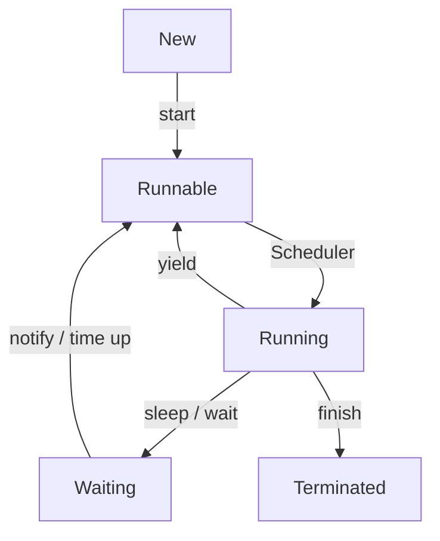

Links: [[10 Process Synchronization]], [[09 Synchronization]]

---

# Multi Threading

A **thread** is a single, lightweight execution path within a process.
A **process** is a self-contained execution environment (an instance of a program).

Multithreading is a mechanism in Java where multiple threads of execution run concurrently (or appear to run at the same time) within a single process. They share the same memory space.

This is used to:

- Perform multiple operations at the same time.
- Maximize CPU utilization.
- Improve application responsiveness (e.g., keeping a UI responsive while a background task runs).

> [!TIP] > Analogy: Kitchen Staff
>
> - **Single-Threaded:** One chef doing everything. He chops veggies, then cooks, then plates. If chopping takes 10 mins, the stove sits idle.
> - **Multi-Threaded:** A full team.
>   - **Thread 1 (Chef):** Cooking on the stove.
>   - **Thread 2 (Sous Chef):** Chopping vegetables.
>   - **Thread 3 (Dishwasher):** Cleaning plates.
> - **Result:** Everything happens at once (Concurrency), and the meal is ready much faster.

### Thread Life Cycle

A thread goes through several states:



1.  **New:** The thread object has been created, but `start()` has not been called.
2.  **Runnable:** The thread is ready to run. `start()` has been called, and it's waiting for the thread scheduler to allocate CPU time.
3.  **Running:** The thread is actively executing its code.
4.  **Waiting / Blocked:** The thread is temporarily inactive. It might be waiting for a lock (to enter a `synchronized` block), or it has been told to wait (`wait()`), sleep (`sleep()`), or join (`join()`).
5.  **Terminated (Dead):** The thread has finished its `run()` method or has otherwise stopped.

### Thread Priorities

Every thread has a priority, which is an integer between 1 and 10. The thread scheduler uses this to decide which thread to run.

- **MIN_PRIORITY (1)**
- **NORM_PRIORITY (5)** - Default
- **MAX_PRIORITY (10)**

```java
Thread t1 = new Thread();
t1.setPriority(Thread.MAX_PRIORITY); // 10
System.out.println(t1.getPriority());
```

### How to Create a Thread

There are two ways:

#### By extending the `Thread` class

You override the `run()` method with the code you want the thread to execute.

```java
class MyThread extends Thread {
    @Override
    public void run() {
        // This is the job the thread will do
        System.out.println("Thread is running by extending Thread class...");
    }
}

// To use it:
MyThread t1 = new MyThread();
t1.start(); // This calls the run() method in a new thread
```

#### By implementing the `Runnable` interface

This is the **preferred** way because Java does not support multiple inheritance. By implementing `Runnable`, your class is free to extend another class.

You implement the `run()` method, and then pass an instance of your class to the `Thread` constructor.

```java
class MyRunnable implements Runnable {
    @Override
    public void run() {
        // This is the job the thread will do
        System.out.println("Thread is running by implementing Runnable...");
    }
}

// To use it:
MyRunnable myRunnable = new MyRunnable();
Thread t2 = new Thread(myRunnable);
t2.start(); // This calls myRunnable.run() in a new thread

// With a Lambda (since Runnable is a Functional Interface):
Runnable r = () -> System.out.println("Thread running from lambda...");
Thread t3 = new Thread(r);
t3.start();
```

### Key Thread Methods

- **`start()`**: This is the method you call to begin the thread. It puts the thread in the **Runnable** state. The JVM then calls the `run()` method. **You never call `run()` directly.**

- **`run()`**: This is where you put the logic that the thread will execute.

- **`sleep(long millis)`**: (Static method) Pauses the **current** thread for a specified time. It does _not_ release any locks it holds.

- **`join()`**: This method makes the _current_ thread wait until the thread it's called on (`t.join()`) is **Terminated**.

- **`yield()`**: (Static method) A hint to the scheduler that the current thread is willing to give up its time slice.

- **`isAlive()`**: Checks if the thread is in the New or Terminated state.

### Synchronization

When multiple threads access shared resources (like a variable), you can get problems like data inconsistency or race conditions.

Synchronization is the mechanism to control this access, ensuring only one thread can access a shared resource at a time.

This is achieved using the synchronized keyword (on methods or blocks) or other concurrency tools.
