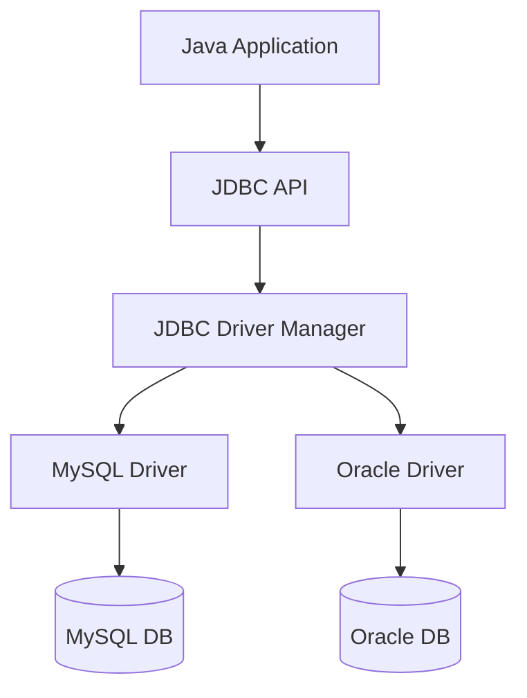

Links: [[13.5 Servlets]]

---

# Java Database Connectivity (JDBC)

JDBC is an API that helps Java applications communicate with databases. It allows us to execute SQL statements and retrieve results.

## Architecture



### JDBC Drivers

1.  **Type 1 (JDBC-ODBC Bridge)**: Uses ODBC driver. Legacy.
2.  **Type 2 (Native API)**: Uses client-side libraries.
3.  **Type 3 (Network Protocol)**: Uses middleware server.
4.  **Type 4 (Thin Driver)**: Pure Java driver. Direct connection. **Most common.**

## Basic Steps

1.  **Import Package**: `import java.sql.*;`
2.  **Load Driver**: `Class.forName("com.mysql.cj.jdbc.Driver");`
3.  **Establish Connection**: `DriverManager.getConnection(url, user, pass);`
4.  **Create Statement**: `con.createStatement();`
5.  **Execute Query**: `executeQuery()` or `executeUpdate()`
6.  **Process Results**: `ResultSet`
7.  **Close Connection**: `con.close();`

```java
String url = "jdbc:mysql://localhost:3306/mydb";
try (Connection con = DriverManager.getConnection(url, "root", "pass");
     Statement st = con.createStatement()) {

    ResultSet rs = st.executeQuery("SELECT * FROM users");
    while (rs.next()) {
        System.out.println(rs.getString("name"));
    }
} catch (SQLException e) {
    e.printStackTrace();
}
```

## Prepared Statement

Used for pre-compiled SQL statements. It is faster and prevents **SQL Injection**.

```java
String sql = "INSERT INTO users (name, email) VALUES (?, ?)";
PreparedStatement ps = con.prepareStatement(sql);

ps.setString(1, "John");
ps.setString(2, "john@example.com");

int rows = ps.executeUpdate();
```

## Transactions

A transaction is a group of operations that are treated as a single unit. Either all succeed (Commit) or all fail (Rollback).

By default, JDBC is in **auto-commit** mode (each query is committed immediately).

```java
try {
    con.setAutoCommit(false); // 1. Disable auto-commit

    // Operation 1
    st.executeUpdate("UPDATE account SET balance = balance - 100 WHERE id = 1");

    // Operation 2
    st.executeUpdate("UPDATE account SET balance = balance + 100 WHERE id = 2");

    con.commit(); // 2. Commit if all good
} catch (SQLException e) {
    con.rollback(); // 3. Rollback if error
}
```

## Stored Procedures (CallableStatement)

Used to call stored procedures in the database.

```java
// Procedure: CREATE PROCEDURE get_user(IN id INT, OUT name VARCHAR(50))
CallableStatement cs = con.prepareCall("{call get_user(?, ?)}");

cs.setInt(1, 10); // Input parameter
cs.registerOutParameter(2, Types.VARCHAR); // Output parameter

cs.execute();

String name = cs.getString(2); // Get output
```

## Merging Data (Joins)

We can execute complex SQL queries involving joins using JDBC just like normal queries.

```java
String sql = "SELECT u.name, o.order_id FROM users u JOIN orders o ON u.id = o.user_id";
ResultSet rs = st.executeQuery(sql);
```
