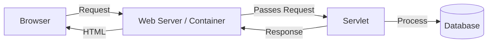
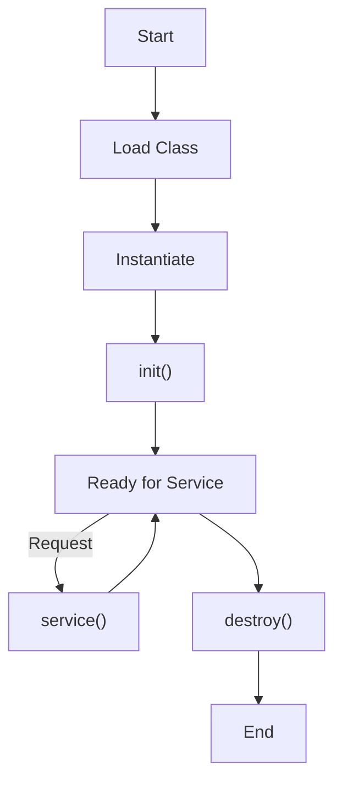

Links: [[13 JSP]]

---

# Servlets

A Servlet is a Java class that runs on a web server and responds to HTTP requests. It extends the capabilities of a server.

## Architecture



## Servlet Life Cycle

The life cycle is managed by the Servlet Container (e.g., Tomcat).

1.  **Loading & Instantiation**: The container loads the class and creates an instance.
2.  **Initialization (`init()`)**: Called once. Used for setup.
3.  **Request Handling (`service()`)**: Called for every request. Dispatches to `doGet()`, `doPost()`, etc.
4.  **Destruction (`destroy()`)**: Called once before removing the servlet. Used for cleanup.



## Handling Requests

We typically extend `HttpServlet`.

```java
@WebServlet("/hello")
public class HelloServlet extends HttpServlet {

    // Handle GET requests
    protected void doGet(HttpServletRequest req, HttpServletResponse res) throws IOException {
        res.setContentType("text/html");
        PrintWriter out = res.getWriter();
        out.println("<h1>Hello World</h1>");
    }

    // Handle POST requests
    protected void doPost(HttpServletRequest req, HttpServletResponse res) throws IOException {
        String name = req.getParameter("username");
        // Process data...
    }
}
```

## Session Tracking

HTTP is **stateless**. To maintain state between requests (e.g., login status), we use session tracking.

### Cookies

Small pieces of data stored on the client's browser.

```java
// Create Cookie
Cookie c = new Cookie("user", "John");
res.addCookie(c);

// Read Cookie
Cookie[] cookies = req.getCookies();
```

### HttpSession

Stored on the server. A unique Session ID is sent to the client (usually via cookie).

```java
// Create/Get Session
HttpSession session = req.getSession();
session.setAttribute("user", "John");

// Retrieve Data
String user = (String) session.getAttribute("user");

// Invalidate (Logout)
session.invalidate();
```

### URL Rewriting

Appending the session ID to the URL.
`http://example.com/app?jsessionid=12345`

### Hidden Form Fields

`<input type="hidden" name="session_id" value="12345">`
