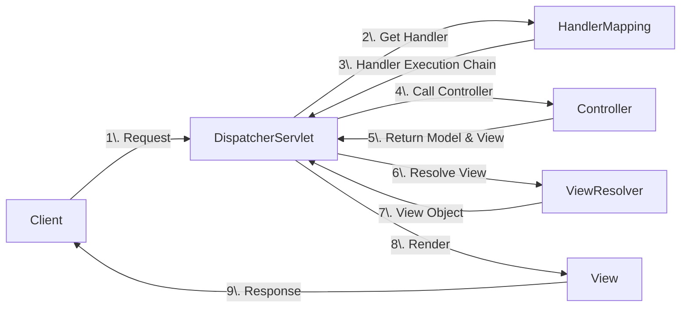

Links: [[15 Spring Boot]]

---

# Spring Framework

Spring is a powerful, lightweight, and open-source framework for building enterprise Java applications. It provides comprehensive infrastructure support, allowing developers to focus on the application logic.

## Spring MVC Architecture

Spring MVC (Model-View-Controller) is a framework built on the Servlet API. It is designed around a central servlet called **DispatcherServlet** that dispatches requests to controllers.

### Key Components

1.  **DispatcherServlet**: The "Front Controller". It receives all incoming HTTP requests and delegates them to other components.
2.  **HandlerMapping**: Maps a request to a specific Controller method (based on URL, method, etc.).
3.  **Controller**: Handles the request, processes business logic (often by calling a Service), and returns a Model and View name.
4.  **ViewResolver**: Resolves the view name (e.g., "home") to an actual view file (e.g., `/WEB-INF/views/home.jsp`).
5.  **View**: Renders the response (HTML, JSON, etc.).

### Request Flow



1.  **Request**: Client sends a request to the server.
2.  **Dispatch**: `DispatcherServlet` intercepts the request.
3.  **Mapping**: It asks `HandlerMapping` which Controller should handle this request.
4.  **Execution**: It calls the `Controller`.
5.  **Processing**: Controller processes the request and returns a `ModelAndView` object (data + view name).
6.  **Resolution**: `DispatcherServlet` asks `ViewResolver` to find the actual View file.
7.  **Rendering**: The View is rendered with the Model data and sent back to the client.

## Core Concepts

### POJO (Plain Old Java Object)

A **POJO** is an ordinary Java object that is not bound by any special restriction other than those forced by the Java Language Specification. It does not depend on any external libraries or frameworks.

- **Characteristics**:
  - Does **not** extend prespecified classes (e.g., `extends HttpServlet`).
  - Does **not** implement prespecified interfaces (e.g., `implements EntityBean`).
  - Does **not** contain prespecified annotations.
- **Benefit**: Increases readability, reusability, and testability. Spring empowers Pojo-based programming.

```java
public class StudentPojo {
    private String name;
    private int id;

    // Standard Getters and Setters
    public String getName() { return name; }
    public void setName(String name) { this.name = name; }
}
```

### Inversion of Control (IoC)

In traditional programming, the custom code calls the library to perform tasks. In **IoC**, the flow of control is inverted: the framework (container) calls the custom code.

- **Principle**: "Don't call us, we'll call you." (Hollywood Principle).
- **Role**: The IoC Container is responsible for instantiating, configuring, and assembling objects (Beans).


#### IoC Containers

Spring provides two types of containers:

1.  **BeanFactory**: The simplest container, providing basic DI support. (Lazy loading).
2.  **ApplicationContext**: Extends BeanFactory, adding enterprise-specific features like event propagation, declarative mechanisms, and integration with AOP. (Eager loading).

```java
class Application {
    public static void main(String[] args) {
        ApplicationContext context = new ClassPathXmlApplicationContext("applicationContext.xml");
        Student student = (Student) context.getBean("student");
        student.getCourse();
    }
}
```

### Dependency Injection (DI)

DI is the specific design pattern used to implement IoC. It removes the dependency creation responsibility from the class.

> [!TIP] > Analogy: The Restaurant
>
> - **Traditional (No IoC):** You are hungry. You go to the kitchen, find ingredients, cook the meal, and eat it. You control everything.
> - **IoC (Inversion of Control):** You sit at a table. You don't go to the kitchen. You just _declare_ what you want.
> - **Dependency Injection (DI):** The **Waiter** (Container) brings the food (Dependency) to your table. You didn't make it; it was _injected_ into your table setting by the waiter.

**Types of DI:**

- [[#Constructor Injection (Recommended)]]
- [[#Setter Injection]]
- [[#Field Injection]]

#### Constructor Injection (Recommended)

Dependencies are providfed through the class constructor.

- **Pros**: Ensures the object is fully initialized (immutable). Good for mandatory dependencies.
- **Cons**: Can lead to "Constructor bloat" if too many dependencies.

```java
@Service
class UserService {
    private final UserRepository repo;

    @Autowired
    public UserService(UserRepository repo) {
        this.repo = repo;
    }
}
```

#### Setter Injection

Dependencies are provided through setter methods.

- **Pros**: Good for optional dependencies. Can re-inject dependencies later.
- **Cons**: Object might be in a partial state if setters aren't called.

```java
@Service
class OrderService {
    private OrderRepository repo;

    @Autowired
    public void setRepo(OrderRepository repo) {
        this.repo = repo;
    }
}
```

#### Field Injection

Dependencies are injected directly into fields using reflection.

- **Pros**: Very concise code.
- **Cons**: Hides dependencies. Difficult to test (cannot instantiate without reflection). **Not recommended.**

```java
@Service
class PaymentService {
    @Autowired
    private PaymentRepository repo; // Field Injection
}
```

### Aspect-Oriented Programming (AOP)

AOP is a programming paradigm that aims to increase modularity by allowing the separation of **cross-cutting concerns** (functionality that affects multiple parts of an application, like logging, security, or transaction management).

**Key Terminologies:**

- **Aspect**: A module that encapsulates a concern (e.g., `LoggingAspect`).
- **Advice**: The actual action to be taken (code to run).
  - `@Before`: Run before the method.
  - `@After`: Run after the method (regardless of outcome).
  - `@AfterReturning`: Run only if method succeeds.
  - `@AfterThrowing`: Run only if method throws exception.
  - `@Around`: Run before and after (can control execution).
- **Pointcut**: An expression that selects where the Advice should be applied (e.g., "all methods in Service package").
- **JoinPoint**: The specific point in execution (e.g., method execution) where an aspect can be plugged in.
- **Weaving**: The process of linking aspects with other application types to create an advised object.

#### Example: Around Advice (Measuring Execution Time)

```java
@Aspect
@Component
public class PerformanceAspect {

    @Around("execution(* com.example.service.*.*(..))")
    public Object measureTime(ProceedingJoinPoint joinPoint) throws Throwable {
        long start = System.currentTimeMillis();

        Object result = joinPoint.proceed(); // Execute the actual method

        long end = System.currentTimeMillis();
        System.out.println("Execution time: " + (end - start) + "ms");

        return result;
    }
}
```

## [[14.5 Beans and Autowiring]]

## Configuration Styles

Spring supports three ways to define beans:

### XML Configuration (Legacy)

Beans are defined in an XML file (e.g., `applicationContext.xml`).

```xml
<bean id="Student" class="Student">
    <property name="Course"/>
</bean>
<bean id="Course" class="Student" autowire="course"/>
```

### Annotation-based Configuration

Beans are defined using annotations on classes.

- `@Component`, `@Service`, `@Repository`, `@Controller`
- `@Autowired` for injection.
- Requires `<context:component-scan>` or `@ComponentScan`.

### Java-based Configuration (Modern)

Beans are defined in a Java class using `@Configuration` and `@Bean`.

```java
@Configuration
public class AppConfig {
    @Bean
    public MyService myService() {
        return new MyService();
    }
}
```
