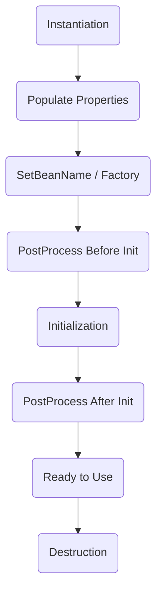

Links: 
___
# Beans

They are objects managed by spring IoC container. It forms the backbone of the application.

The scope defines the lifecycle and visibility of a bean managed by the Spring container.

| Scope           | Description                                                   | Use Case                          |
| :-------------- | :------------------------------------------------------------ | :-------------------------------- |
| **Singleton**   | **(Default)** Only one instance is created per IoC container. | Stateless beans (Services, DAOs). |
| **Prototype**   | A new instance is created every time the bean is requested.   | Stateful beans (User sessions).   |
| **Request**     | One instance per single HTTP request.                         | Web apps (Request-specific data). |
| **Session**     | One instance per HTTP Session.                                | Web apps (User login info).       |
| **Application** | One instance per `ServletContext`.                            | Web apps (Global config).         |
| **WebSocket**   | One instance per WebSocket lifecycle.                         | Real-time apps.                   |

```java
@Component
@Scope("prototype")
public class MyPrototypeBean { ... }
```

Or we can use:

```java
@Component
@prototypescope
public class MyPrototypeBean { ... }
```

## Autowiring

Autowiring is the process where Spring automatically resolves and injects dependent beans into your bean without need for explicit configuration.

**Modes of Autowiring:**

1.  **no**: (Default) No automatic wiring. You must wire explicitly.
2.  **byName**: Spring looks for a bean with the same **name** as the property.
3.  **byType**: Spring looks for a bean with the same **class type**. (Fails if multiple beans of same type exist).
4.  **constructor**: Similar to byType, but applies to constructor arguments.

**Handling Ambiguity (`@Qualifier` & `@Primary`):**
If multiple beans of the same type exist (e.g., `PayPalService` and `StripeService` both implementing `PaymentService`), Spring throws `NoUniqueBeanDefinitionException`.

1.  **@Qualifier**: Specify the bean name to inject.
    ```java
    @Autowired
    @Qualifier("payPalService")
    private PaymentService paymentService;
    ```
2.  **@Primary**: Mark one bean as the default.
    ```java
    @Component
    @Primary
    public class PayPalService implements PaymentService { ... }
    ```

## Bean Life Cycle

The lifecycle of a Spring Bean is managed by the container, from creation to destruction.



1.  **Instantiation**: The container creates the bean instance (calls constructor).
2.  **Populate Properties**: Dependencies are injected.
3.  **Aware Interfaces**: If bean implements `BeanNameAware`, etc., setters are called.
4.  **Pre-Initialization**: `BeanPostProcessor.postProcessBeforeInitialization()` is called.
5.  **Initialization**: Custom init method (`@PostConstruct` or `init-method` in XML) is executed.
6.  **Post-Initialization**: `BeanPostProcessor.postProcessAfterInitialization()` is called. (AOP proxies are often created here).
7.  **Ready**: Bean is ready for use.
8.  **Destruction**: When container shuts down, `@PreDestroy` or `destroy-method` is called.

#### Implementing Life Cycle Callbacks

**Using Interfaces:**

```java
@Component
public class MyBean implements InitializingBean, DisposableBean {
    @Override
    public void afterPropertiesSet() {
        // Initialization logic
    }

    @Override
    public void destroy() {
        // Cleanup logic
    }
}
```

**Using Annotations (Recommended):**

```java
@Component
public class MyBean {
    @PostConstruct
    public void init() {
        // Initialization logic
    }

    @PreDestroy
    public void cleanup() {
        // Cleanup logic
    }
}
```