---
header-includes:
  - \usepackage{minitoc}
  - \mtcselectlanguage{english}
include-before:
  - \dominitoc
  - \setcounter{minitocdepth}{4}
---


# Java {#java}

\minitoc


Java is a high-level, class-based, object-oriented programming language that is designed to have as few implementation dependencies as possible. It is a general-purpose programming language intended to let application developers _write once, run anywhere_ (WORA).

It follows the four pillars of OOP:

1. [[01 Inheritance]]
2. [[02 Polymorphism]]
3. [[03 Encapsulation]]
4. [[04 Abstraction]]

### Java Environment

The Java environment consists of three main components: JDK, JRE, and JVM.

#### JDK (Java Development Kit)

It is a software development environment used for developing Java applications. It includes the JRE, an interpreter/loader (Java), a compiler (javac), an archiver (jar), a documentation generator (Javadoc), and other tools needed in Java development.

#### JRE (Java Runtime Environment)

It provides the libraries, the Java Virtual Machine (JVM), and other components to run applets and applications written in the Java programming language. It does not contain tools for development like compilers or debuggers.

#### JVM (Java Virtual Machine)

It is an abstract machine. It is a specification that provides a runtime environment in which Java bytecode can be executed.

**Responsibilities of JVM:**

- Loads code
- Verifies code
- Executes code
- Provides runtime environment

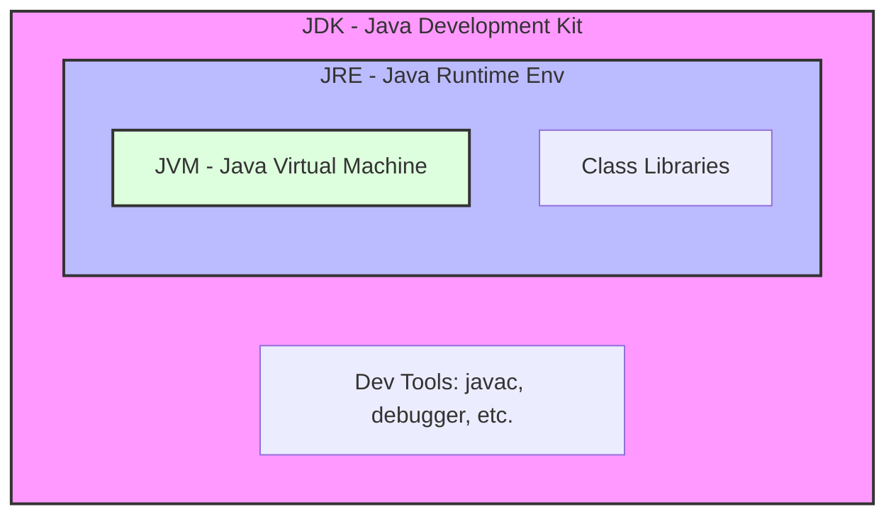

> [!TIP] > Analogy: The Kitchen
>
> - **JDK (The Whole Kit):** The entire kitchen setup. It has the stove, ingredients, **AND** the recipe books/tools to _create_ new dishes.
> - **JRE (Runtime Env):** A kitchen that is only for _serving_ food. It has the stove and ingredients to cook (run) the meal, but no tools to write new recipes.
> - **JVM (The Chef):** The person who actually cooks. They read the recipe (Bytecode) and use the stove (Hardware) to make the food (Machine Code).

### Compilation Process

1.  **Source Code**: The programmer writes code in `.java` files.
2.  **Compilation**: The `javac` compiler converts the source code into **Bytecode** (`.class` files). Bytecode is platform-independent.
3.  **Execution**: The JVM reads the bytecode and translates it into machine code (native machine language) for the specific operating system.

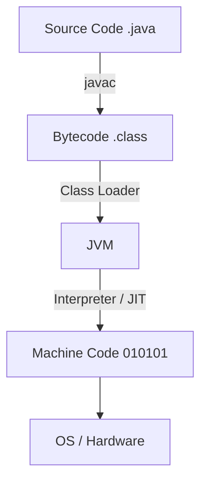

### Java Source File Structure

A Java source file can contain multiple classes, but there are specific rules:

1.  There can be only **one** `public` class per source file.
2.  If there is a public class, the name of the file must match the name of the public class.
3.  If there is no public class, the file can have any name.

```java
// File: Main.java
public class Main { // File name must be Main.java
    public static void main(String[] args) {
        System.out.println("Hello World");
    }
}
class Helper { // Non-public class allowed in the same file
    // ...
}
```

### Classes and Objects

#### Class

A class is a blueprint or template from which objects are created. It defines a set of properties (fields) and methods that are common to all objects of one type.

#### Object

An object is an instance of a class. It has:

- **State**: Represented by attributes (variables).
- **Behavior**: Represented by methods.
- **Identity**: A unique name (reference) to interact with it.

> [!TIP] > Analogy: Blueprint vs. House
>
> - **Class** = **The Blueprint**. It's just a drawing on paper. You can't live in it. It describes what the house _will_ look like.
> - **Object** = **The House**. It's the actual physical building created from the blueprint. You can build 100 identical houses (Objects) from 1 blueprint (Class).

```java
class Car {
    // Fields (State)
    String color;
    String model;

    // Method (Behavior)
    void drive() {
        System.out.println("Driving " + model);
    }
}

public class Test {
    public static void main(String[] args) {
        Car myCar = new Car(); // Creating an object
        myCar.model = "Tesla";
        myCar.drive();
    }
}
```

### Access Specifiers

Access specifiers determine the visibility of classes, methods, and variables.

| Specifier                 | Class | Package | Subclass | World |
| :------------------------ | :---: | :-----: | :------: | :---: |
| **public**                |  Yes  |   Yes   |   Yes    |  Yes  |
| **protected**             |  Yes  |   Yes   |   Yes    |  No   |
| **default** (no modifier) |  Yes  |   Yes   |    No    |  No   |
| **private**               |  Yes  |   No    |    No    |  No   |

1.  **private**: Accessible only within the class.
2.  **default**: Accessible only within the package.
3.  **protected**: Accessible within the package and by subclasses in other packages.
4.  **public**: Accessible everywhere.

### Static Members

The `static` keyword indicates that a member belongs to the **class** rather than to any specific instance (object).

#### Static Variable

- Shared among all instances of the class.
- Memory is allocated only once when the class is loaded.

#### Static Method

- Can be called without creating an object of the class.
- Can only access static data members and other static methods.
- Cannot use `this` or `super` keywords.

```java
class Counter {
    static int count = 0; // Static variable

    Counter() {
        count++; // Increments the shared counter
    }

    static void showCount() { // Static method
        System.out.println("Count: " + count);
    }
}
```

### Final Members

The `final` keyword is used to restrict the user.

1.  **Final Variable**: Value cannot be changed (constant).
2.  **Final Method**: Cannot be overridden by subclasses.
3.  **Final Class**: Cannot be inherited.

```java
final int MAX_SPEED = 100;
// MAX_SPEED = 120; // Compilation Error
```

### Constructors

A constructor is a block of code similar to a method that is called when an instance of an object is created.

#### Rules

- Name must be the same as the class name.
- No return type (not even `void`).
- Called automatically when `new` is used.

#### Types

1.  **Default Constructor**: Provided by the compiler if no constructor is defined.
2.  **No-Args Constructor**: A constructor with no parameters defined by the user.
3.  **Parameterized Constructor**: A constructor with parameters to initialize fields.
4.  **Copy Constructor**: Used to create an object by copying variables from another object.

```java
class Student {
    String name;
    int age;

    // No-Args Constructor
    Student() {
        this.name = "Unknown";
        this.age = 0;
    }

    // Parameterized Constructor
    Student(String name, int age) {
        this.name = name;
        this.age = age;
    }

    // Copy Constructor
    Student(Student s) {
        this.name = s.name;
        this.age = s.age;
    }
}
```

### `this` Keyword

`this` is a reference variable that refers to the **current object**.

**Usages:**

1.  Refer to current class instance variable (to resolve shadowing).
2.  Invoke current class constructor (`this()`).
3.  Return the current class instance.

```java
class A {
    int x;

    A(int x) {
        this.x = x; // Distinguishes instance variable from parameter
    }

    A() {
        this(10); // Calls the parameterized constructor
    }
}
```


\newpage


# Inheritance {#inheritance}

\minitoc


Inheritance is a mechanism where one class acquires the properties and behaviors (methods) of another class.
This creates an "IS-A" relationship (e.g., a `Dog` IS-A `Animal`).

We need at least 2 classes.
We use `extends` keyword to inherit properties from one class to another.

The class which is inherited is called Parent or Super class.
The class which inherits is called Child, Derived or Sub Class.

> [!TIP] > Analogy: DNA & Genetics
>
> - **Parent Class:** Your Father. He has blue eyes (Properties) and walks fast (Behavior).
> - **Child Class:** You. You _automatically_ get the blue eyes and fast walk (Inheritance).
> - **Extending:** You can also learn to play guitar (New Method), which your father couldn't do. You are an "extension" of him.

Private properties and methods (`private`) are _not directly accessible_ by the child class, but they are still part of the object's structure.
Protected (`protected`) and `default` (package-private) members are inherited and accessible within the same package. `protected` members are also accessible to subclasses in different packages.

```java
class A { // Parent / Super class
    int a = 10;

    int func(){
        return 10;
    }

    private int privateFunc(){
        return 55;
    }
}

class B extends A { // Child / Sub class
    void test() {
        System.out.println(a); // Works
        System.out.println(func()); // Works
        // System.out.println(privateFunc()); // Error: privateFunc() has private access in A
    }
}
```

Here, B is child class and A is parent class.

#### Types of Inheritance

##### Single Level

When one class inherits another. (A -> B)

```java
class A {}

class B extends A {}
```

##### Multi Level

When one class inherits another, which in turn inherits from another class. (A -> B -> C)

```java
class A {}

class B extends A {}

class C extends B {}
```

##### Hierarchical

When many classes inherit one single class. (A -> B, A -> C)

```java
class A {}

class B extends A {}

class C extends A {}
```

##### Multiple

When one class inherits from many classes.

Java does not allow for multiple inheritance using classes. This is to avoid the "Diamond Problem" (ambiguity if two parent classes have a method with the same name).

We must use interface to achieve this.

```java
class A {}

class B {}

// class C extends A,B {} // This does not work. Compilation Error.
```

##### Hybrid

When we use more than one kind of inheritance at the same time.

Java's class inheritance is hybrid, but without Multiple inheritance. A common example is Hierarchical + Multi Level.

```java
class A {} // Grandparent

class B extends A {} // Parent 1

class C extends B {} // Child (Multi-level)

class D extends A {} // Parent 2 (Hierarchical)
```

#### Method Overriding

When a child class provides a specific implementation for a method that is already defined in its parent class.

The method signature (name, parameters) must be the same.

The @Override annotation is used to tell the compiler we intend to override a method.

```java
class Animal {
    void makeSound() {
        System.out.println("Generic animal sound");
    }
}

class Dog extends Animal {
    @Override
    void makeSound() {
        System.out.println("Woof");
    }
}
```

#### `super` Keyword

`super` is a reference variable used within a child class to refer to the immediate parent class object.

It is used in two ways:

1. To call the super class's constructor.
2. To access the super class's members (variables or methods).

```java
super.member // e.g., super.variable, super.method()
super()      // e.g., super(), super(parameter)
```

The first one is used for calling the super class's members. This is most useful when a child class has overridden a method and needs to call the parent's version.

The second one is used for calling the super class's constructor.

- `super()` _must_ be the first statement in a child class's constructor.
- If you do not explicitly call `super()`, the compiler automatically inserts a call to the parent's non-parameterized `super()` constructor.

```java
class Parent {
    String name;

    Parent(String name) {
        this.name = name;
    }

    void print() {
        System.out.println("Parent print");
    }
}

class Child extends Parent {
    Child(String name) {
        // Must call super() because Parent has no default constructor
        super(name);
    }

    @Override
    void print() {
        super.print(); // Calls Parent's print() method
        System.out.println("Child print");
        System.out.println(super.name); // Accesses Parent's variable
    }
}
```


\newpage


# Polymorphism {#polymorphism}

\minitoc


"Many Forms"

Polymorphism is an OOP mechanism where an object (or method) can take on many different forms. Its main advantage is code reusability and flexibility.

> [!TIP] > Analogy: One Person, Many Roles
> Consider a man named **John**.
>
> - At home, he behaves as a **Father**.
> - At work, he behaves as an **Employee**.
> - At the store, he behaves as a **Customer**.
>
> **John** is the same object, but his behavior changes based on the context (who is interacting with him). This is Polymorphism.

It is achieved by two ways:

- **Compile-Time Polymorphism (Static Binding):** Achieved via **Method Overloading**.
- **Run-Time Polymorphism (Dynamic Binding):** Achieved via **Method Overriding**.

#### Compile-Time Polymorphism (Method Overloading)

When a class has multiple methods with the same name but different parameters, it is known as method overloading. The correct method to call is decided at **compile-time** based on the arguments provided.

Method overloading is distinguished by:

- The **no. of parameters**
- The **datatypes** of parameters
- The **sequence** of parameters of different types

**Note:** The return type alone is **not** enough to overload a method.

```java
class Calculator {
    void add(int a, int b) {
        System.out.println(a + b);
    }

    void add(int a, int b, int c) { // Different no. of parameters
        System.out.println(a + b + c);
    }

    void add(double a, double b) { // Different datatypes
        System.out.println(a + b);
    }
}
```

##### Constructor Overloading

We can also overload constructors in the same way to provide different ways of initializing an object.

```java
class A {
    A(){
        // non-parameterized constructor
    }
    A(int a){
        // parameterized constructor
    }

    // To call a constructor from another constructor in the same class:
    A(int a, int b) {
        this(a); // 'this()' calls another constructor
        // ...
    }
}
```

#### Run-Time Polymorphism (Method Overriding)

When a method in a **subclass** has the same name, parameters, and return type as a method in its **superclass**, it is known as method overriding.

This is also known as dynamic polymorphism because the actual method call is resolved at **run-time**, based on the type of the _object_, not the type of the _reference_.

This requires an "IS-A" relationship ([[01 Inheritance]]).

##### Rules for Method Overriding

- The method signature (name and parameters) must be identical.
- The return type must be the same or a _covariant_ type (a subclass of the original return type).
- The access modifier in the child class must be the same or _less restrictive_ (e.g., `protected` in parent can be `public` in child, but not `private`).
- `final` or `static` methods cannot be overridden.

##### Dynamic Method Dispatch

This is the mechanism that makes run-time polymorphism work. We can use a parent class reference to hold a child class object.

```java
class Animal { // Parent class
    void sound() {
        System.out.println("Animal makes a sound");
    }
}

class Dog extends Animal { // Child class
    @Override
    void sound() {
        // 'super' keyword calls the parent's method
        // super.sound();
        System.out.println("Woof! Woof!");
    }
}

class Cat extends Animal { // Child class
    @Override
    void sound() {
        System.out.println("Meow!");
    }
}

public class Main {
    public static void main(String[] args) {
        Animal a; // Parent class reference

        a = new Dog(); // Dynamic Polymorphic Assignment
        a.sound();     // Output: Woof! Woof! (Java checks the object type at run-time)

        a = new Cat(); // Re-assign to another subclass
        a.sound();     // Output: Meow! (Java checks the object type again)
    }
}
```

Here, even though the reference `a` is of type `Animal`, the JVM calls the `sound()` method from the _actual object_ (`Dog` or `Cat`) at run-time.


\newpage


# Encapsulation {#encapsulation}

\minitoc


It is a fundamental OOP principle used for **data hiding**.
Encapsulation is a mechanism in which data (attributes or variables) and the methods that operate on that data are bundled together within a single unit (a class).

We make a "capsule" of a class. What's inside the capsule (the internal state) is not available for direct access from outside the class.

Attributes are bound to the methods. We cannot get or set the values of the attributes directly by doing `obj.var`. We must use accessor methods like `obj.getVar()` (a **getter**) or `obj.setVar(value)` (a **setter**).

Encapsulation provides:
- **Data Hiding (Security):** The internal state of the object is hidden. This prevents outside code from accidentally or maliciously corrupting the object's data.
- **Control & Data Integrity:** By using setter methods, we can add validation logic. Data remains authentic because we control *how* it is set.
- **Flexibility & Modularity:** The implementation details are hidden. We can change the internal implementation (e.g., rename a variable, change its data type) without breaking the external code that uses our class, as long as the public getter/setter methods remain the same.
- **Code Reusability:** Encapsulated classes are easier to reuse as self-contained "black boxes."

#### How to Achieve Encapsulation
1.  Declare the class's variables (fields) as `private`.
2.  Provide public **getter** (accessor) methods to view the variables.
3.  Provide public **setter** (mutator) methods to modify the variables.

Setters are where we enforce integrity constraints.

For example:
```java
class Student {
    // 1. Declare variable as private
    private int age;
    
    // 3. Public setter to initialize/modify the variable
    public void setAge(int age) {
        // We add validation logic (integrity constraint)
        if (age > 0 && age < 150) {
            this.age = age;
        } else {
            System.out.println("Invalid age provided.");
            // Or throw new IllegalArgumentException("Invalid age");
        }
    }
    
    // 2. Public getter to access the variable
    public int getAge() {
        return this.age;
    }
}

class Main {
    public static void main(String[] args) {
        Student s1 = new Student();
        
        // s1.age = -10; // Error: 'age' has private access
        
        s1.setAge(20);
        System.out.println(s1.getAge()); // Output: 20
        
        s1.setAge(-10); // Output: Invalid age provided.
        System.out.println(s1.getAge()); // Output: 20 (The value didn't change)
    }
}
````

The encapsulation is:
- **Read-Only:** If we only provide a `getter`, the variable becomes read-only from the outside.
- **Write-Only:** If we only provide a `setter`, the variable becomes write-only.

\newpage


# Abstraction {#abstraction}

\minitoc


It is a concept which is used for **hiding implementation complexity** and showing only the essential features or functionality to the user.

(Note: **Encapsulation** is used for *data hiding* (protecting variables). **Abstraction** is used for *implementation hiding* (hiding *how* a method works)).

Abstraction focuses on *what* an object does, not *how* it does it.

Abstraction can be achieved using an abstract class or by an interface.

#### Abstract Class
We use `abstract` keyword to declare a class as abstract.
An abstract class provides a template for other classes, forcing them to implement certain methods.

You **cannot** create an object (instantiate) of an abstract class.

- We can declare abstract as well as non-abstract (concrete) methods.  
- It can have constructors, static methods, and `final` methods.
- It works together with [[02 Polymorphism#Run-Time Polymorphism (Method Overriding)]].

Abstract methods are declared with the `abstract` keyword. These methods don't have a definition or body in the class in which they are declared. They **must** be overridden by a subclass to provide the definition.

```java
// We cannot create an object of 'Shape'
abstract class Shape {
    int color;
    
    // Concrete (non-abstract) method with a body
    void setColor(int c) {
        this.color = c;
    }

    // Abstract method - no body
    // Forces subclasses to provide their own version
    abstract void draw(); 
}

class Circle extends Shape {
    // We MUST implement the abstract 'draw' method
    @Override
    void draw() {
        System.out.println("Drawing a circle");
    }
}
````

#### Interface
An interface is a blueprint of a class. It specifies what a class must do, but not how.

It is used to achieve 100% abstraction (before Java 8).

- We use the `interface` keyword.
- All methods in an interface are `public` and `abstract` by default.
- All variables (fields) are `public`, `static`, and `final` (constants) by default.
- A class uses the `implements` keyword to use an interface.
- A class can implement **multiple** interfaces. This is how Java achieves multiple inheritance.

```java
interface Drawable {
    void draw(); // This is public and abstract by default
}

interface Loggable {
    void log(String message);
}

// A class can implement multiple interfaces
class Circle implements Drawable, Loggable {
    @Override
    public void draw() {
        System.out.println("Drawing a circle");
    }
    
    @Override
    public void log(String message) {
        System.out.println("LOG: " + message);
    }
}
```

##### `default` and `static` methods

Java 8 allowed interfaces to have methods with implementation:

- **`default` methods:** A class can override them, but doesn't have to. It allows adding new functionality to an interface without breaking existing classes.
- **`static` methods:** Utility methods that are part of the interface, not a specific object.

###### Default Methods

Allows adding new methods to interfaces with a default implementation, without breaking existing classes that implement the interface.

We use the default keyword.

```java
interface MyInterface {
    void existingMethod();
    
    default void newDefaultMethod() {
        System.out.println("This is a default implementation.");
    }
}

class MyClass implements MyInterface {
    public void existingMethod() {
        // ...
    }
    // No need to implement newDefaultMethod(), it's optional.
}
```

###### Static Method

Interfaces can now have static methods. These are utility methods that are part of the interface, not the implementing class.

They are called on the interface itself, not on an instance.

```java
interface MyInterface {
    static void utilityMethod() {
        System.out.println("This is a static utility method.");
    }
}

// How to call it:
MyInterface.utilityMethod();
```

#### Abstract Class vs. Interface

- **Methods:** An abstract class can have both abstract and concrete methods. An interface (pre-Java 8) can only have abstract methods.

- **Variables:** An abstract class can have any type of variable (instance, static, final). An interface can only have `public static final` constants.

- **Inheritance:** A class can `extends` only **one** abstract class. A class can `implements` **many** interfaces.

- **Constructor:** An abstract class can have a constructor (which is called by the subclass constructor). An interface **cannot** have a constructor.

- **Purpose:**
    - Use an **abstract class** for an "IS-A" relationship, when you want to provide common, shared code for all subclasses (e.g., `Dog` IS-A `Animal`, and all animals `breathe()`).
    - Use an **interface** for a "CAN-DO" relationship, when you want to define a capability or contract that unrelated classes can share (e.g., `Circle` CAN-DO `Drawable`, `Car` CAN-DO `Drawable`).


\newpage


# Exception Handling {#exception-handling}

\minitoc


Java is robust i.e. it can deal with the errors.

Exception handling is a mechanism through which we catch and manage errors or unusual events during run time that disrupts the normal flow of the program.

Exceptions are run-time errors.

> [!TIP] > Analogy: The Safety Net
>
> - **Program Execution:** Walking on a tightrope.
> - **Exception:** Slipping and falling.
> - **Default Behavior (No Handling):** You fall to the ground and crash (Program Terminates/Crashes).
> - **Exception Handling (Try-Catch):** You have a **Safety Net** below. If you fall, the net catches you, and you can climb back down safely (Graceful Termination or Recovery) instead of dying.

To handle an exception, we can either:

- **Handle it:** Using a `try-catch` block.
- **Duck it (Declare it):** Using the `throws` keyword, forcing the calling method to handle it.

$\\$

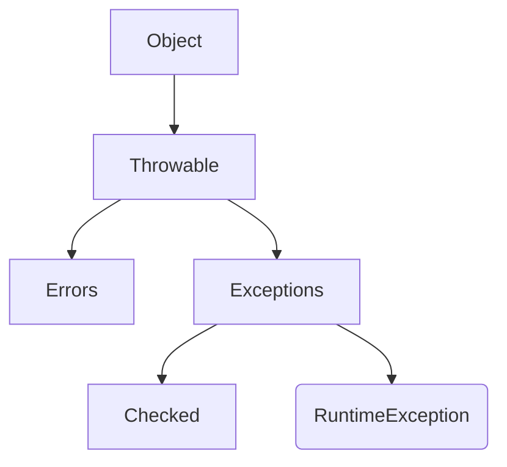

**Throwable:** The root class for everything that can be thrown.

- **Error:** Represents serious, unrecoverable problems that should not be caught (e.g., `OutOfMemoryError`, `StackOverflowError`).

- **Exception:** Represents conditions that a program might want to catch and handle.

There are two types of exceptions:

- **Checked:** Exceptions that are checked at compile-time. The compiler forces you to handle them (with try-catch or throws).

  E.g. `IOException`, `SQLException`, `FileNotFoundException`, `ClassNotFoundException`.

- **Unchecked (RuntimeExceptions):** Exceptions that are checked at run-time. They are typically programming errors and the compiler does not force you to handle them.

  E.g. `ArithmeticException`, `ArrayIndexOutOfBoundsException`, `NumberFormatException`, `NullPointerException`.

#### Using `{java} try - catch - finally` block

- **`try`:** The code which might throw an exception is written inside the `try` block.
- **`catch`:** The handler for the exception. If an exception of the specified type occurs in `try`, this block is executed.
- **`finally`:** This block is **always** executed, whether an exception was thrown or not. It's used for cleanup (e.g., closing a file or database connection).

```java
try {
    // Code that might cause an error
    int[] myNumbers = {1, 2, 3};
    System.out.println(myNumbers[10]); // This throws an exception
} catch (ArrayIndexOutOfBoundsException e) {
    // Handler for that specific error
    System.out.println("Error: Index is out of bounds.");
} catch (Exception e) {
    // A general handler for any other exception
    System.out.println("Something else went wrong.");
} finally {
    // This code always runs
    System.out.println("The 'try-catch' block is finished.");
}
```

#### `throw` Keyword

The `throw` keyword is used to **manually** or **explicitly** throw an exception (or any `Throwable` object) from within a method body.

You use it when your program logic detects an error condition.

```java
public void validateAge(int age) {
    if (age < 18) {
        // We create a new exception object and "throw" it.
        // This immediately stops the method.
        throw new ArithmeticException("Access denied: You must be 18 or older.");
    } else {
        System.out.println("Access granted.");
    }
}

// How to call it:
public static void main(String[] args) {
    try {
        validateAge(15);
    } catch (ArithmeticException e) {
        System.out.println("Caught exception: " + e.getMessage());
    }
}
```

#### `throws` Keyword

The throws keyword is used in a method signature (the method declaration).

It tells the compiler that this method might throw a checked exception.

It does _not_ handle the exception. It "ducks" or passes the responsibility of handling the exception to whatever method _calls_ it.

```java
// This method "throws" a checked exception
// It does not handle it, it just warns the caller.
public void readFile(String fileName) throws FileNotFoundException {
    File file = new File(fileName);
    FileInputStream fis = new FileInputStream(file);
    // ... logic to read file
}

// The calling method MUST handle it
public void openMyFile() {
    try {
        readFile("myFile.txt");
    } catch (FileNotFoundException e) {
        System.out.println("Error: The file was not found.");
    }
}
```

#### `throw` vs. `throws`

| Feature     | `throw`                                               | `throws`                                                       |
| ----------- | ----------------------------------------------------- | -------------------------------------------------------------- |
| **Purpose** | To **explicitly throw** an exception.                 | To **declare** that a method might throw an exception.         |
| **Usage**   | Inside a method body.                                 | In the method signature.                                       |
| **Syntax**  | Followed by an **instance** (object) of an exception. | Followed by the **class names** of exceptions.                 |
| **Example** | `throw new IOException();`                            | `void myMethod() throws IOException { ... }`                   |
| **Type**    | Can throw any `Throwable`.                            | Used only for **checked exceptions** (unchecked are optional). |

#### User Defined Exceptions

We can create our own exceptions by extending the `Exception` class (for checked) or `RuntimeException` class (for unchecked).

```java
// 1. Create the exception class
class InsufficientFundsException extends Exception {
    public InsufficientFundsException(String message) {
        super(message);
    }
}

// 2. Use it
class BankAccount {
    double balance;

    void withdraw(double amount) throws InsufficientFundsException {
        if (amount > balance) {
            throw new InsufficientFundsException("Not enough money!");
        }
        balance -= amount;
    }
}
```

#### Try with resource

We can use try with resource on objects of classes which implement `AutoClosable` interface.

```java
// The resource (fis) is automatically closed at the end
try (FileInputStream fis = new FileInputStream("test.txt")) {
    // read file
} catch (IOException e) {
    e.printStackTrace();
}
```

We use this when we want to perform an operation on one resource and then close it. E.g. file I/O.


\newpage


# Collections {#collections}

\minitoc


Collections are predefined data structures that Java provides.
Collections are a group of objects or entities considered as a single unit that store data.

We only need to make their objects and use them.

A package in java has either classes or interfaces.
Collections have all of their data structures defined using classes and interfaces in the `java.util` package.

The main interfaces are **List**, **Queue**, **Set**, and **Map**.

- List, Queue, and Set store single items.
- Map stores data in **key-value pairs**.

##### Synchronization

Synchronization (in this context) means **thread-safety**.

- A synchronized collection can be safely accessed by multiple threads at the same time.
- A non-synchronized collection can be corrupted if modified by multiple threads simultaneously.
- Most modern collections (`ArrayList`, `HashMap`) are **non-synchronized** for better performance in single-threaded applications.
- Legacy classes (`Vector`, `Hashtable`) are synchronized.

##### Collection Framework

The Collection Framework is a group of classes and interfaces that implements these data structures.

It is divided into two main categories:

1.  `java.util.Collection`: The root interface for lists, sets, and queues.
2.  `java.util.Map`: A separate interface for key-value pair structures.

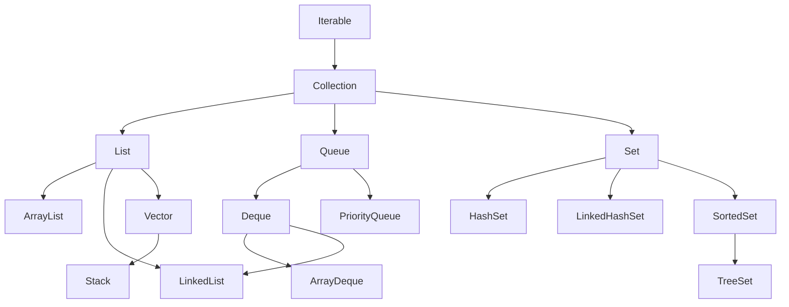

###### Collection Interface

It is the main interface of the collection framework that is inherited by `List`, `Queue`, and `Set`.

#### Wrapper Classes for Primitive Datatypes

Since collections can only store objects, we need wrapper classes for primitive datatypes.

- `Integer` for `int`
- `Double` for `double`
- `Boolean` for `boolean`
- `Character` for `char`
- Also: `Float`, `Long`, `Short`, `Byte`

#### Array

A basic, fixed-size data structure.

```java
int[] arr1;
int []arr2;
int arr3[] = { 0, 1, 3 };
```

To declare size:

```java
String[] st = new String[10];
st[0] = "John"
st[9] = "Silksong"
```

#### Iterator

It is an interface used to traverse (access) the data in a `Collection`.

It traverses elements in a sequential, forward-only manner.

It allows for the safe removal of elements while traversing. You cannot do this with a for-each loop (it would cause a ConcurrentModificationException).

It lies in `java.util` package.

Creation of Iterator:

```java
Iterator<String> it = myCollection.iterator();
```

##### Methods of Iterator

- `hasNext() -> bool`: Returns `true` if the iteration has more elements.
- `next() -> Object`: Returns the next element in the iteration.
- `remove()`: Removes the last element returned by `next()` from the collection.

#### ListIterator (child of Iterator)

An iterator for `List`s that allows traversal in both directions.

It has these extra functions:

- `hasPrevious()`
- `previous()`
- `add(Object o)`
- `set(Object o)`

It is created as:

```java
ListIterator<Integer> it = myList.listIterator();
```

### [[06.1 Linear Collections]]

### [[06.2 Maps]]

### [[06.3 Sets]]

\newpage


# Linear Collections {#linear-collections}

\minitoc


#### List
It is an interface for an **ordered** collection of elements.

Features of this interface:

- Allows duplicate elements
- Maintains insertion order
- Supports NULL values
- Index-based access
- Non-synchronized (for modern implementations)

List is implemented by: `ArrayList`, `LinkedList`, and `Vector`.

##### Common List Methods

- `add(Object o)`: Appends to the end.
- `add(int index, Object o)`: Inserts at a specific index.
- `get(int index)`: Returns element at the index.
- `set(int index, Object o)`: Updates an element.
- `remove(Object o)`: Removes the first occurrence of the object.
- `remove(int index)`: Removes the element at the index.
- `indexOf(Object o)`: Returns the index of the first occurrence.
- `lastIndexOf(Object o)`
- `contains(Object o) -> bool`: Checks if an element is present or not.
- `size()`
- `clear()`: Remove all the elements from the list.

##### ArrayList (implements List)

It is a class that implements a **resizable array**.

- It has the same features as `List`.
- Fast for random access (`get()`).
- Slower for insertions/deletions in the middle.
- It by default has size 10 and it grows by 1.5x when full.

#### LinkedList
Java's LinkedList is a doubly-linked list.

It also implements the Deque (Double-Ended Queue) interface.

- It can store duplicate as well as null values.
- It follows insertion order.
- It is non-synchronized.
- Fast for insertions/deletions (at the beginning, middle, or end).
- Slow for random access (`get()`), as it must traverse the list.

Because it implements `Deque`, it has methods for adding/removing from both ends:

```java
addFirst(object o);
addLast(object o);
getFirst();
getLast();
removeFirst();
removeLast();
```

#### Vector
It is a legacy class (JDK 1.0) that acts like a resizable array.

- It is **synchronized** (thread-safe).
- It by default has size 10 and it grows by **2x** when full.
- `ArrayList` is preferred in single-threaded environments.

#### Stack

It is a legacy class (JDK 1.0) that extends `Vector`.

- Implements LIFO (Last-In, First-Out) order.
- It is **synchronized**.
- The modern, preferred alternative is using an `ArrayDeque`.

##### Methods

```java
push(object o);
pop();
peek();
search(object o); // returns 1-based index, or -1
empty(); // checks if stack is empty
```

#### Queue
An interface for a collection that follows **FIFO** (First-In, First-Out) order.

Classes used to implement queue:

- `LinkedList` (a general-purpose queue)
- `PriorityQueue` (a priority-based queue)
- `ArrayDeque` (a double-ended queue)

##### PriorityQueue

It implements the `Queue` interface, but orders elements by priority.

- By default, it is a **min-heap** (the smallest element has the highest priority and is at the head).
- We can provide a `Comparator` for custom ordering.
- It is non-synchronized.
- Does not follow insertion order.

Methods come in two flavors:

1. **Throws Exception:** `add()`, `remove()` (removes head), `element()` (peeks head)
2. **Returns Special Value:** `offer()` (returns `false` if full), `poll()` (returns `null` if empty), `peek()` (returns `null` if empty)


\newpage


# Maps {#maps}

\minitoc


A `Map` is an object that maps keys to values. A map cannot contain duplicate keys; each key can map to at most one value.

It does **not** inherit from the `Collection` interface.

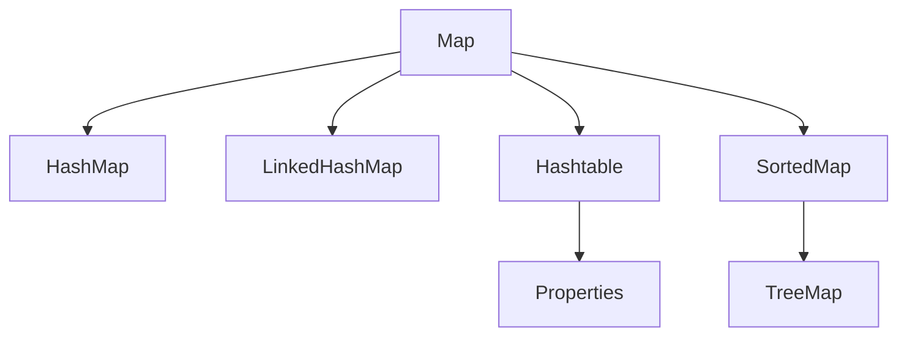

### Map Interface Methods

- `put(K key, V value)`: Associates the specified value with the specified key.
- `get(Object key)`: Returns the value to which the specified key is mapped.
- `remove(Object key)`: Removes the mapping for a key.
- `containsKey(Object key)`: Returns `true` if this map contains a mapping for the specified key.
- `keySet()`: Returns a `Set` view of the keys.
- `entrySet()`: Returns a `Set` view of the mappings.

### HashMap

`HashMap` is a hash table based implementation.

- **Order**: Unordered.
- **Null**: Allows one null key and multiple null values.
- **Synchronization**: Non-synchronized.
- **Performance**: $O(1)$ for `get` and `put`.

```java
Map<String, Integer> map = new HashMap<>();
map.put("Apple", 10);
map.put("Banana", 20);
map.put(null, 0); // Valid

System.out.println(map.get("Apple")); // 10
```

### LinkedHashMap

`LinkedHashMap` extends `HashMap` and maintains a linked list of the entries.

- **Order**: Insertion order (or access order).
- **Null**: Allows one null key.
- **Performance**: Slightly slower than `HashMap` due to linked list overhead.

```java
Map<String, Integer> map = new LinkedHashMap<>();
map.put("One", 1);
map.put("Two", 2);
// Iteration will guarantee "One" then "Two"
```

### TreeMap

`TreeMap` implements `SortedMap` and uses a Red-Black tree.

- **Order**: Sorted according to the natural ordering of its keys, or by a `Comparator`.
- **Null**: **Cannot** have a null key.
- **Performance**: $O(\log n)$.

```java
Map<String, Integer> map = new TreeMap<>();
map.put("Banana", 2);
map.put("Apple", 1);

System.out.println(map); // {Apple=1, Banana=2} (Sorted by Key)
```

### Hashtable

`Hashtable` is a legacy class (JDK 1.0).

- **Order**: Unordered.
- **Null**: **Cannot** have null keys or values.
- **Synchronization**: **Synchronized** (Thread-safe).
- **Performance**: Slower than `HashMap` due to synchronization.

### Properties Class

The `Properties` class extends `Hashtable`. It represents a persistent set of properties.

- Keys and values are both **Strings**.
- Used to read/write configuration files (`.properties`).

**Key Methods:**

- `setProperty(String key, String value)`
- `getProperty(String key)`
- `store(OutputStream out, String comments)`
- `load(InputStream in)`

```java
Properties p = new Properties();
p.setProperty("user", "admin");
p.setProperty("password", "1234");

// Saving to a file
try (FileOutputStream fos = new FileOutputStream("config.properties")) {
    p.store(fos, "User Config");
} catch (IOException e) {
    e.printStackTrace();
}
```

#### Comparison

| Feature          | HashMap     | LinkedHashMap | TreeMap     | Hashtable   |
| :--------------- | :---------- | :------------ | :---------- | :---------- |
| **Order**        | Random      | Insertion     | Sorted      | Random      |
| **Null Key**     | Allowed (1) | Allowed (1)   | Not Allowed | Not Allowed |
| **Null Value**   | Allowed     | Allowed       | Allowed     | Not Allowed |
| **Synchronized** | No          | No            | No          | Yes         |


\newpage


# Sets {#sets}

\minitoc


A `Set` is a collection that cannot contain duplicate elements. It models the mathematical set abstraction.

The `Set` interface contains only methods inherited from `Collection` and adds the restriction that duplicate elements are prohibited.

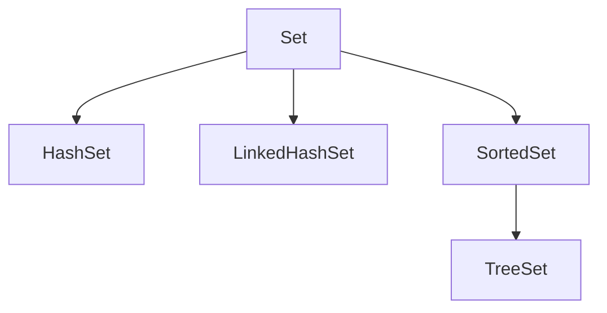

### HashSet

`HashSet` is the best-performing implementation. It uses a hash table.

- **Order**: Unordered (no guarantee of iteration order).
- **Null**: Allows one null element.
- **Performance**: Constant time $O(1)$ for basic operations (`add`, `remove`, `contains`), assuming the hash function disperses elements properly.
- **Synchronization**: Not synchronized.

```java
Set<String> fruits = new HashSet<>();
fruits.add("Apple");
fruits.add("Banana");
fruits.add("Apple"); // Duplicate, will be ignored

System.out.println(fruits); // Output order is unpredictable
```

### LinkedHashSet

`LinkedHashSet` is a hash table and linked list implementation of the `Set` interface.

- **Order**: Insertion order (the order in which elements were inserted).
- **Null**: Allows one null element.
- **Performance**: Slightly slower than `HashSet` due to the added expense of maintaining the linked list, but still $O(1)$.

```java
Set<String> fruits = new LinkedHashSet<>();
fruits.add("Apple");
fruits.add("Banana");
fruits.add("Orange");

System.out.println(fruits); // Output: [Apple, Banana, Orange]
```

### SortedSet Interface

A `Set` that further provides a _total ordering_ on its elements. The elements are ordered using their **natural ordering**, or by a `Comparator` provided at sorted set creation time.

### TreeSet

`TreeSet` implements `SortedSet` (and `NavigableSet`). It uses a **Red-Black tree** structure.

- **Order**: Sorted (Natural ascending order or custom Comparator).
- **Null**: Does **not** allow null elements (throws `NullPointerException`).
- **Performance**: $O(\log n)$ for basic operations.
- **Use Case**: When you need a set that is always sorted.

```java
Set<Integer> numbers = new TreeSet<>();
numbers.add(5);
numbers.add(1);
numbers.add(10);

System.out.println(numbers); // Output: [1, 5, 10]
```

#### Comparison

| Feature              | HashSet     | LinkedHashSet        | TreeSet                  |
| :------------------- | :---------- | :------------------- | :----------------------- |
| **Internal Storage** | HashMap     | HashMap + LinkedList | TreeMap (Red-Black Tree) |
| **Order**            | Unordered   | Insertion Order      | Sorted Order             |
| **Null Elements**    | Allowed (1) | Allowed (1)          | Not Allowed              |
| **Performance**      | $O(1)$      | $O(1)$               | $O(\log n)$              |


\newpage


# Sorting and Comparator {#sorting-and-comparator}

\minitoc


The Java sort methods use **Timm sort**, which is a hybrid of insertion sort and merge sort.

We use the following to sort a collection:

```java
Arrays.sort();
Collections.sort();
```

`Arrays.sort()` can sort static arrays like `int []`

`Collections.sort()` sorts lists (like `ArrayList`).

#### Comparable Interface

It is used to sort the data or object in its **natural order**, inside the class itself.

It provides one method to implement: `compareTo(T o)`.

We implement the `Comparable` interface in the class whose objects are to be arranged.

`compareTo(T o)` compares this object with the other object o.

- **Negative int:** `this` object comes _before_ `o`.
- **Positive int:** `this` object comes _after_ `s2`.
- **Zero:** `this` object and `o` are equal in terms of sorting.

```java
// Student class now defines its "natural order" as sorting by roll number
class Student implements Comparable<Student>{
    int roll;
    String name;

    // Constructor...

    @Override
    public int compareTo(Student other) {
        // We want to sort by roll number
        // 'this' is the first object, 'other' is the second
        return this.roll - other.roll;
    }
}

// Now you can just call:
Collections.sort(listOfStudents);
```

#### Comparator Interface

This is used when we want to define a custom sorting order, _separate_ from the class.

Use a `Comparator` when:

- You want to sort in an order _other_ than the natural order.
- You want to sort objects of a class you _cannot modify_.
- You want to define _multiple different ways_ to sort (e.g., by name, by roll, by grade).

It provides one main method: `compare(T o1, T o2)`.

It is implemented in a separate class.

```java
// A separate class to define sorting by name
class SortStudentByName implements Comparator<Student> {

    @Override
    public int compare(Student s1, Student s2) {
        // Use String's built-in compareTo for alphabetical sorting
        return s1.name.compareTo(s2.name);
    }
}

// Now you can sort using this new logic:
Collections.sort(listOfStudents, new SortStudentByName());
```

#### Sorting with Lambda Expressions

Since `Comparator` is a **[[10 Functional Interface]]** (it has only one abstract method), we can use a lambda expression instead of writing a whole new class.

```java
// Sort by name using a lambda
Comparator<Student> byName = (s1, s2) -> s1.name.compareTo(s2.name);

// Sort by roll using a lambda
Comparator<Student> byRoll = (s1, s2) -> s1.roll - s2.roll;

// You can pass the lambda directly into the sort method:
Collections.sort(listOfStudents, (s1, s2) -> s1.name.compareTo(s2.name));

// We can even "chain" comparators
// Sort by name, and if names are the same, sort by roll
Comparator<Student> byNameThenRoll = ExampleStudent.byName
        .thenComparing(ExampleStudent.byRoll);
Collections.sort(listOfStudents, byNameThenRoll);
```


\newpage


# Multi Threading {#multi-threading}

\minitoc


A **thread** is a single, lightweight execution path within a process.
A **process** is a self-contained execution environment (an instance of a program).

Multithreading is a mechanism in Java where multiple threads of execution run concurrently (or appear to run at the same time) within a single process. They share the same memory space.

This is used to:

- Perform multiple operations at the same time.
- Maximize CPU utilization.
- Improve application responsiveness (e.g., keeping a UI responsive while a background task runs).

> [!TIP] > Analogy: Kitchen Staff
>
> - **Single-Threaded:** One chef doing everything. He chops veggies, then cooks, then plates. If chopping takes 10 mins, the stove sits idle.
> - **Multi-Threaded:** A full team.
>   - **Thread 1 (Chef):** Cooking on the stove.
>   - **Thread 2 (Sous Chef):** Chopping vegetables.
>   - **Thread 3 (Dishwasher):** Cleaning plates.
> - **Result:** Everything happens at once (Concurrency), and the meal is ready much faster.

#### Thread Life Cycle

A thread goes through several states:

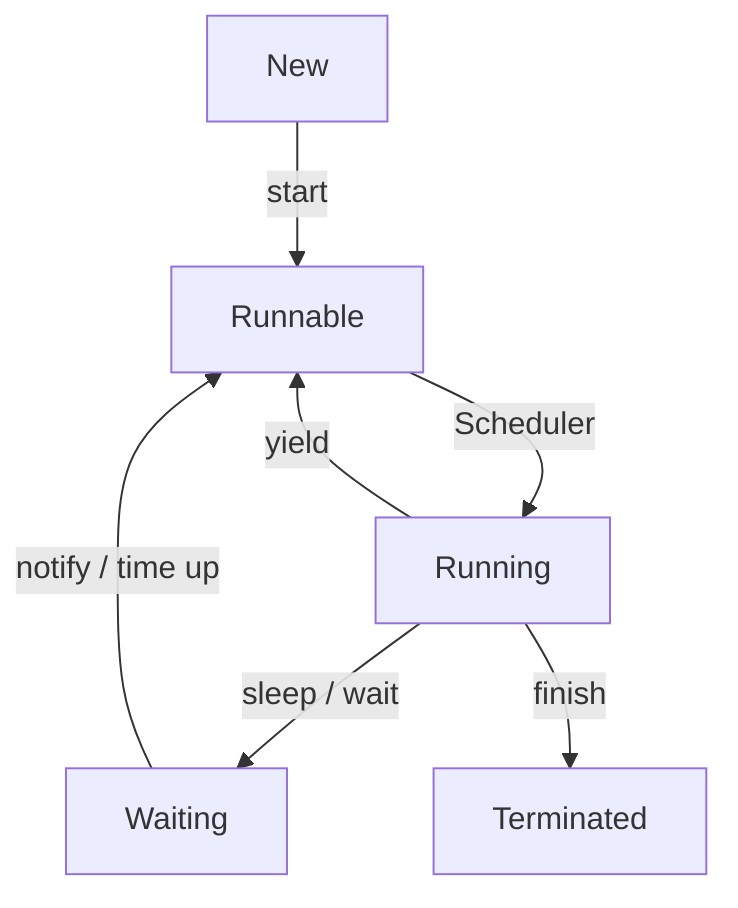

1.  **New:** The thread object has been created, but `start()` has not been called.
2.  **Runnable:** The thread is ready to run. `start()` has been called, and it's waiting for the thread scheduler to allocate CPU time.
3.  **Running:** The thread is actively executing its code.
4.  **Waiting / Blocked:** The thread is temporarily inactive. It might be waiting for a lock (to enter a `synchronized` block), or it has been told to wait (`wait()`), sleep (`sleep()`), or join (`join()`).
5.  **Terminated (Dead):** The thread has finished its `run()` method or has otherwise stopped.

#### Thread Priorities

Every thread has a priority, which is an integer between 1 and 10. The thread scheduler uses this to decide which thread to run.

- **MIN_PRIORITY (1)**
- **NORM_PRIORITY (5)** - Default
- **MAX_PRIORITY (10)**

```java
Thread t1 = new Thread();
t1.setPriority(Thread.MAX_PRIORITY); // 10
System.out.println(t1.getPriority());
```

#### How to Create a Thread

There are two ways:

##### By extending the `Thread` class

You override the `run()` method with the code you want the thread to execute.

```java
class MyThread extends Thread {
    @Override
    public void run() {
        // This is the job the thread will do
        System.out.println("Thread is running by extending Thread class...");
    }
}

// To use it:
MyThread t1 = new MyThread();
t1.start(); // This calls the run() method in a new thread
```

##### By implementing the `Runnable` interface

This is the **preferred** way because Java does not support multiple inheritance. By implementing `Runnable`, your class is free to extend another class.

You implement the `run()` method, and then pass an instance of your class to the `Thread` constructor.

```java
class MyRunnable implements Runnable {
    @Override
    public void run() {
        // This is the job the thread will do
        System.out.println("Thread is running by implementing Runnable...");
    }
}

// To use it:
MyRunnable myRunnable = new MyRunnable();
Thread t2 = new Thread(myRunnable);
t2.start(); // This calls myRunnable.run() in a new thread

// With a Lambda (since Runnable is a Functional Interface):
Runnable r = () -> System.out.println("Thread running from lambda...");
Thread t3 = new Thread(r);
t3.start();
```

#### Key Thread Methods

- **`start()`**: This is the method you call to begin the thread. It puts the thread in the **Runnable** state. The JVM then calls the `run()` method. **You never call `run()` directly.**

- **`run()`**: This is where you put the logic that the thread will execute.

- **`sleep(long millis)`**: (Static method) Pauses the **current** thread for a specified time. It does _not_ release any locks it holds.

- **`join()`**: This method makes the _current_ thread wait until the thread it's called on (`t.join()`) is **Terminated**.

- **`yield()`**: (Static method) A hint to the scheduler that the current thread is willing to give up its time slice.

- **`isAlive()`**: Checks if the thread is in the New or Terminated state.

#### Synchronization

When multiple threads access shared resources (like a variable), you can get problems like data inconsistency or race conditions.

Synchronization is the mechanism to control this access, ensuring only one thread can access a shared resource at a time.

This is achieved using the synchronized keyword (on methods or blocks) or other concurrency tools.


\newpage


# Synchronization {#synchronization}

\minitoc


It is a mechanism to control access of multiple threads to shared resources.

If we don't do synchronization, it leads to:

- **Race condition:** A situation where the outcome of an operation depends on the unpredictable sequence or timing of other threads' operations.
- **Data inconsistency:** The shared data is left in an incorrect or invalid state.
We can achieve synchronization using several mechanisms:

#### Mutual Exclusion (Mutex)

A **Mutex** (or lock) is a simple synchronization primitive. It ensures that only one thread can be in a **critical section** (the part of the code accessing the shared resource) at a time.

- A thread **acquires** the lock before entering the critical section.
- If the lock is already held, the thread blocks (waits) until the lock is **released**.
- The thread **releases** the lock after exiting the critical section.

#### Semaphores

A semaphore is a more general synchronization tool. It manages a counter (a number of "permits").

- **Counting Semaphore:** Allows up to $N$ threads to access a resource. A thread must `acquire()` a permit to proceed. If the counter is zero, the thread blocks. When done, it `release()` the permit.
- **Binary Semaphore:** A semaphore with $N=1$. It acts just like a Mutex.

#### Monitors (Java's `synchronized`)

A **Monitor** is a high-level construct that combines a Mutex with condition variables, making synchronization easier. Java's `synchronized` keyword is a built-in implementation of a monitor.

- **Synchronized Method:**    
    ```java
    public synchronized void safeMethod() {
        // This entire method is a critical section.
        // The lock is on the 'this' object instance.
    }
    ```
    
- **Synchronized Block:**
    ```java
    public void myMethod() {
        // ... non-critical code ...
    
        // The lock can be 'this' or any other shared object
        synchronized(this) { 
            // Critical section: only one thread at a time
            // can execute this block on the *same object*.
        }
    
        // ... other non-critical code ...
    }
    ```
    
- **Static Synchronized Method:**
    ```java
    public static synchronized void safeStaticMethod() {
        // The lock is on the Class object (e.g., MyClass.class),
        // not an instance.
    }
    ```

#### Key Thread Methods

- **`sleep(long millis)`**: (Static method) Pauses the **current** thread for a specified time. **It does not release any locks it holds.**
- **`join()`**: A thread (`t1`) calls `t2.join()`. This makes `t1` (the _calling_ thread) wait until `t2` (the thread the method is called on) completes its execution. Join kills the thread it is used on. 
- **`yield()`**: (Static method) A hint to the thread scheduler that the current thread is willing to give up its current time slice. The scheduler may ignore this. It transfers thread from running to runnable. It does not kill the thread. 
- **`isAlive()`**: Checks if a thread has been started and has not yet died.
- **`wait()`, `notify()`, `notifyAll()`**: These are methods of the `Object` class (not `Thread`) and are used for inter-thread communication, typically within `synchronized` blocks.
    - **`wait()`**: Causes the current thread to release the lock and wait.
    - **`notify()`**: Wakes up a single waiting thread.
    - **`notifyAll()`**: Wakes up all waiting threads.


\newpage


# Functional Interface {#functional-interface}

\minitoc


A **Functional Interface** is an interface that contains exactly one abstract method. It can have any number of default or static methods.

It is also known as **SAM** (Single Abstract Method) interface.

The `Runnable` interface is a classic example: it has only one abstract method `void run()`.

We use the `@FunctionalInterface` annotation to ensure compile-time checking.

### Functional Programming in Java

Java 8 introduced functional programming features, allowing for more concise and declarative code.

#### Key Concepts

1.  **Pure Functions**: Functions that always produce the same output for the same input and have no side effects.
2.  **Immutability**: Data objects are not modified after creation.
3.  **Higher-Order Functions**: Functions that can take other functions as arguments or return them as results.

#### Example: Returning a Function

```java
// Higher-Order Function Example
public Function<Integer, Integer> createMultiplier(int factor) {
    // Returns a function that multiplies by 'factor'
    return (n) -> n * factor;
}

Function<Integer, Integer> doubler = createMultiplier(2);
System.out.println(doubler.apply(5)); // Output: 10
```

### Lambda Expressions

Lambda expressions are a concise way to represent an anonymous function that implements a functional interface.

**Syntax**: `(parameters) -> { body }`

#### Use in Threads

**Old Way (Anonymous Class):**

```java
Runnable r1 = new Runnable() {
    public void run() { System.out.println("Old"); }
};
```

**New Way (Lambda):**

```java
Runnable r2 = () -> System.out.println("New");
Thread t = new Thread(r2);
t.start();
```

### Types of Functional Interface

Java provides built-in functional interfaces in the `java.util.function` package.

#### Consumer

Takes an argument and returns nothing (`void`). Used for performing actions.

- **Method**: `void accept(T t)`

```java
Consumer<String> printer = (s) -> System.out.println(s);
printer.accept("Hello Consumer");
```

#### Supplier

Takes no argument and returns a value. Used for lazy generation of values.

- **Method**: `T get()`

```java
Supplier<Double> randomValue = () -> Math.random();
System.out.println(randomValue.get());
```

#### Function

Takes an argument and returns a result. Used for transformation.

- **Method**: `R apply(T t)`

```java
Function<String, Integer> lengthFinder = (s) -> s.length();
System.out.println(lengthFinder.apply("Hello")); // 5
```

#### Predicate

Takes an argument and returns a boolean. Used for conditional checks.

- **Method**: `boolean test(T t)`

```java
Predicate<Integer> isEven = (n) -> n % 2 == 0;
System.out.println(isEven.test(4)); // true
```

### Method References

A shorthand notation of a lambda expression to call a method.

**Syntax**: `ClassName::methodName`

```java
List<String> names = Arrays.asList("a", "b", "c");

// Lambda
names.forEach(s -> System.out.println(s));

// Method Reference
names.forEach(System.out::println);
```

### Stream API

The Stream API (`java.util.stream`) is used to process collections of objects in a functional style.

**Operations:**

- **Intermediate**: `filter`, `map`, `sorted` (Lazy)
- **Terminal**: `collect`, `forEach`, `reduce` (Eager)

```java
List<String> names = Arrays.asList("Alice", "Bob", "Charlie");

List<String> result = names.stream()
    .filter(s -> s.startsWith("A"))
    .map(String::toUpperCase)
    .collect(Collectors.toList());

System.out.println(result); // [ALICE]
```


\newpage


# Advanced Features {#advanced-features}

\minitoc


This file covers modern Java language enhancements and features introduced in recent versions (Java 7+).

### Try-with-resources

Introduced in Java 7, it simplifies resource management by automatically closing resources that implement the `AutoCloseable` interface.

```java
// The resource (fis) is automatically closed at the end
try (FileInputStream fis = new FileInputStream("test.txt")) {
    // read file
} catch (IOException e) {
    e.printStackTrace();
}
```

### Annotations

#### Type Annotations (Java 8)

Annotations can be placed almost anywhere a type is used, not just on declarations. This is primarily used by plug-in type-checking tools to find bugs (e.g., `@NonNull`).

```java
List<@NonNull String> names = new ArrayList<>();
```

#### Repeating Annotations (Java 8)

Allows the same annotation to be applied multiple times to a single declaration.

```java
@Schedule(day="Mon")
@Schedule(day="Fri")
class MyTask { }
```

### Java Module System (Java 9)

Also known as **Project Jigsaw**. It is used to organize large applications into modules.

- **Encapsulation**: Can hide entire packages.
- **Dependencies**: Explicitly defines what a module needs.
- **Descriptor**: Uses `module-info.java`.

```java
// module-info.java
module com.myapp.main {
    requires com.myapp.utils; // Depends on another module
    exports com.myapp.api;    // Makes this package public
}
```

### Diamond Syntax with Anonymous Classes (Java 9)

The diamond operator `<>` can be used with anonymous inner classes.

```java
List<String> list = new ArrayList<>() {
    // Anonymous subclass body
};
```

### Local Variable Type Inference (Java 10)

Allows the compiler to infer the type of a local variable from its initializer using the `var` keyword.

```java
var message = "Hello"; // Inferred as String
var map = new HashMap<String, Integer>(); // Inferred as HashMap
```

### Switch Expressions (Java 14)

An enhanced switch statement that can be used as an expression (returns a value).

- **Arrow Syntax (`->`)**: No fall-through, no `break` needed.
- **Yield**: Used to return a value from a block.

```java
String day = "SAT";
String type = switch (day) {
    case "MON", "TUE", "WED", "THU", "FRI" -> "Weekday";
    case "SAT", "SUN" -> "Weekend";
    default -> "Invalid";
};
```

### Records (Java 16)

A concise way to create immutable data carrier classes. The compiler automatically generates the constructor, getters, `equals`, `hashCode`, and `toString`.

```java
record Point(int x, int y) {}

Point p = new Point(10, 20);
System.out.println(p.x()); // 10
```

### Sealed Classes (Java 17)

Restricts which other classes or interfaces may extend or implement them.

- `sealed`: Declares the class is sealed.
- `permits`: Lists the allowed subclasses.

```java
sealed interface Shape permits Circle, Square {}

final class Circle implements Shape {}
final class Square implements Shape {}
```

### Text Blocks (Java 15)

Used to represent multi-line strings.

```java
String json = """
    {
        "name": "John",
        "age": 30
    }
    """;
```


\newpage


# JDBC {#jdbc}

\minitoc


JDBC is an API that helps Java applications communicate with databases. It allows us to execute SQL statements and retrieve results.

### Architecture

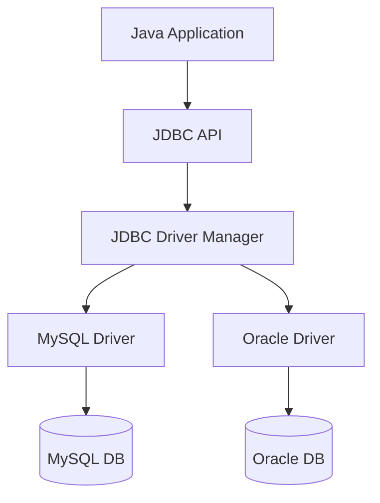

#### JDBC Drivers

1.  **Type 1 (JDBC-ODBC Bridge)**: Uses ODBC driver. Legacy.
2.  **Type 2 (Native API)**: Uses client-side libraries.
3.  **Type 3 (Network Protocol)**: Uses middleware server.
4.  **Type 4 (Thin Driver)**: Pure Java driver. Direct connection. **Most common.**

### Basic Steps

1.  **Import Package**: `import java.sql.*;`
2.  **Load Driver**: `Class.forName("com.mysql.cj.jdbc.Driver");`
3.  **Establish Connection**: `DriverManager.getConnection(url, user, pass);`
4.  **Create Statement**: `con.createStatement();`
5.  **Execute Query**: `executeQuery()` or `executeUpdate()`
6.  **Process Results**: `ResultSet`
7.  **Close Connection**: `con.close();`

```java
String url = "jdbc:mysql://localhost:3306/mydb";
try (Connection con = DriverManager.getConnection(url, "root", "pass");
     Statement st = con.createStatement()) {

    ResultSet rs = st.executeQuery("SELECT * FROM users");
    while (rs.next()) {
        System.out.println(rs.getString("name"));
    }
} catch (SQLException e) {
    e.printStackTrace();
}
```

### Prepared Statement

Used for pre-compiled SQL statements. It is faster and prevents **SQL Injection**.

```java
String sql = "INSERT INTO users (name, email) VALUES (?, ?)";
PreparedStatement ps = con.prepareStatement(sql);

ps.setString(1, "John");
ps.setString(2, "john@example.com");

int rows = ps.executeUpdate();
```

### Transactions

A transaction is a group of operations that are treated as a single unit. Either all succeed (Commit) or all fail (Rollback).

By default, JDBC is in **auto-commit** mode (each query is committed immediately).

```java
try {
    con.setAutoCommit(false); // 1. Disable auto-commit

    // Operation 1
    st.executeUpdate("UPDATE account SET balance = balance - 100 WHERE id = 1");

    // Operation 2
    st.executeUpdate("UPDATE account SET balance = balance + 100 WHERE id = 2");

    con.commit(); // 2. Commit if all good
} catch (SQLException e) {
    con.rollback(); // 3. Rollback if error
}
```

### Stored Procedures (CallableStatement)

Used to call stored procedures in the database.

```java
// Procedure: CREATE PROCEDURE get_user(IN id INT, OUT name VARCHAR(50))
CallableStatement cs = con.prepareCall("{call get_user(?, ?)}");

cs.setInt(1, 10); // Input parameter
cs.registerOutParameter(2, Types.VARCHAR); // Output parameter

cs.execute();

String name = cs.getString(2); // Get output
```

### Merging Data (Joins)

We can execute complex SQL queries involving joins using JDBC just like normal queries.

```java
String sql = "SELECT u.name, o.order_id FROM users u JOIN orders o ON u.id = o.user_id";
ResultSet rs = st.executeQuery(sql);
```


\newpage


# JSP {#jsp}

\minitoc


JSP is a server-side technology used to create dynamic web content. It is an extension of Servlets.
JSP files are compiled into Servlets by the container.

### JSP Life Cycle

1.  **Translation**: JSP -> Servlet (.java)
2.  **Compilation**: Servlet -> Bytecode (.class)
3.  **Loading & Initialization**: `jspInit()`
4.  **Execution**: `_jspService()`
5.  **Destruction**: `jspDestroy()`

### Scripting Elements

1.  **Scriptlet Tag** `<% ... %>`: Contains Java code.
    ```jsp
    <% int count = 0; out.println(count); %>
    ```
2.  **Expression Tag** `<%= ... %>`: Prints a value (no semicolon).
    ```jsp
    <%= "Hello " + name %>
    ```
3.  **Declaration Tag** `<%! ... %>`: Declares methods or variables.
    ```jsp
    <%! int square(int n) { return n*n; } %>
    ```

### Implicit Objects

Objects created by the container and available automatically.

1.  **request**: `HttpServletRequest`
2.  **response**: `HttpServletResponse`
3.  **out**: `JspWriter` (for sending output)
4.  **session**: `HttpSession`
5.  **application**: `ServletContext`
6.  **config**: `ServletConfig`
7.  **pageContext**: Context for the page
8.  **page**: `this` (current servlet instance)
9.  **exception**: `Throwable` (only in error pages)

### Directives

Instructions to the container. Syntax: `<%@ directive ... %>`

1.  **page**: Defines page settings.
    ```jsp
    <%@ page language="java" contentType="text/html" import="java.util.*" %>
    ```
2.  **include**: Includes a file at translation time (static).
    ```jsp
    <%@ include file="header.jsp" %>
    ```
3.  **taglib**: Defines tag libraries (like JSTL).
    ```jsp
    <%@ taglib uri="http://java.sun.com/jsp/jstl/core" prefix="c" %>
    ```

### Standard Actions

XML tags to perform common tasks.

1.  **jsp:include**: Includes a resource at request time (dynamic).
    ```jsp
    <jsp:include page="footer.jsp" />
    ```
2.  **jsp:forward**: Forwards request to another page.
    ```jsp
    <jsp:forward page="login.jsp" />
    ```
3.  **jsp:useBean**: Instantiates a JavaBean.
    ```jsp
    <jsp:useBean id="user" class="com.example.User" />
    <jsp:setProperty name="user" property="name" value="John" />
    ```


\newpage


# Servlets {#servlets}

\minitoc


A Servlet is a Java class that runs on a web server and responds to HTTP requests. It extends the capabilities of a server.

### Architecture

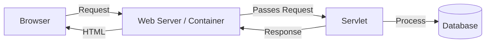

### Servlet Life Cycle

The life cycle is managed by the Servlet Container (e.g., Tomcat).

1.  **Loading & Instantiation**: The container loads the class and creates an instance.
2.  **Initialization (`init()`)**: Called once. Used for setup.
3.  **Request Handling (`service()`)**: Called for every request. Dispatches to `doGet()`, `doPost()`, etc.
4.  **Destruction (`destroy()`)**: Called once before removing the servlet. Used for cleanup.

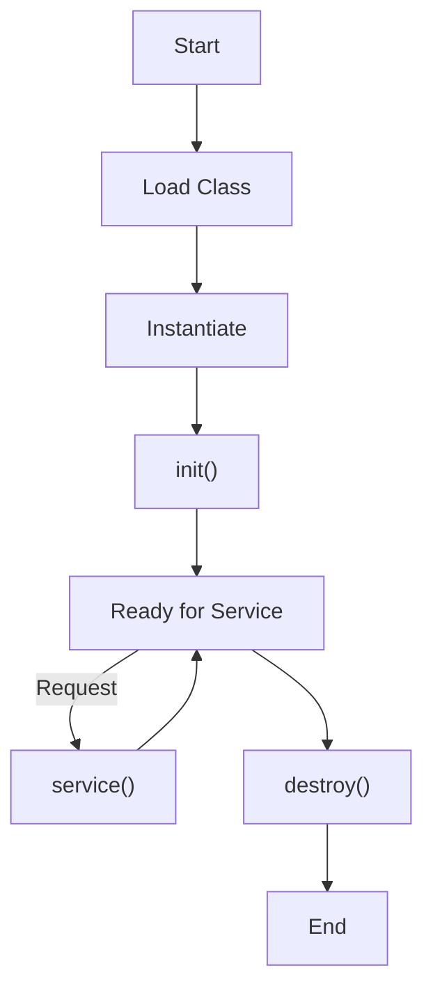

### Handling Requests

We typically extend `HttpServlet`.

```java
@WebServlet("/hello")
public class HelloServlet extends HttpServlet {

    // Handle GET requests
    protected void doGet(HttpServletRequest req, HttpServletResponse res) throws IOException {
        res.setContentType("text/html");
        PrintWriter out = res.getWriter();
        out.println("<h1>Hello World</h1>");
    }

    // Handle POST requests
    protected void doPost(HttpServletRequest req, HttpServletResponse res) throws IOException {
        String name = req.getParameter("username");
        // Process data...
    }
}
```

### Session Tracking

HTTP is **stateless**. To maintain state between requests (e.g., login status), we use session tracking.

#### Cookies

Small pieces of data stored on the client's browser.

```java
// Create Cookie
Cookie c = new Cookie("user", "John");
res.addCookie(c);

// Read Cookie
Cookie[] cookies = req.getCookies();
```

#### HttpSession

Stored on the server. A unique Session ID is sent to the client (usually via cookie).

```java
// Create/Get Session
HttpSession session = req.getSession();
session.setAttribute("user", "John");

// Retrieve Data
String user = (String) session.getAttribute("user");

// Invalidate (Logout)
session.invalidate();
```

#### URL Rewriting

Appending the session ID to the URL.
`http://example.com/app?jsessionid=12345`

#### Hidden Form Fields

`<input type="hidden" name="session_id" value="12345">`


\newpage


# Spring Framework {#spring-framework}

\minitoc


Spring is a powerful, lightweight, and open-source framework for building enterprise Java applications. It provides comprehensive infrastructure support, allowing developers to focus on the application logic.

### Spring MVC Architecture

Spring MVC (Model-View-Controller) is a framework built on the Servlet API. It is designed around a central servlet called **DispatcherServlet** that dispatches requests to controllers.

#### Key Components

1.  **DispatcherServlet**: The "Front Controller". It receives all incoming HTTP requests and delegates them to other components.
2.  **HandlerMapping**: Maps a request to a specific Controller method (based on URL, method, etc.).
3.  **Controller**: Handles the request, processes business logic (often by calling a Service), and returns a Model and View name.
4.  **ViewResolver**: Resolves the view name (e.g., "home") to an actual view file (e.g., `/WEB-INF/views/home.jsp`).
5.  **View**: Renders the response (HTML, JSON, etc.).

#### Request Flow

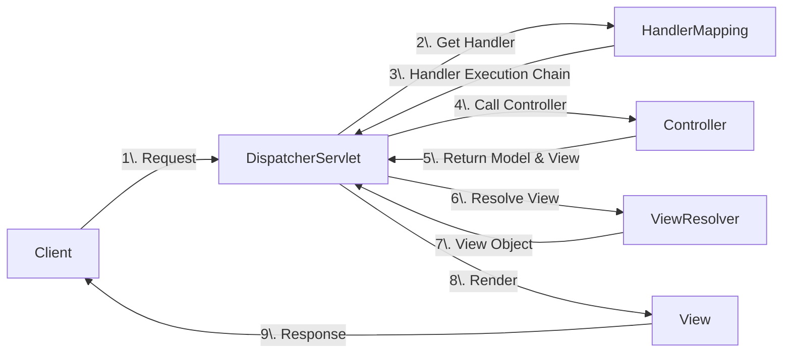

1.  **Request**: Client sends a request to the server.
2.  **Dispatch**: `DispatcherServlet` intercepts the request.
3.  **Mapping**: It asks `HandlerMapping` which Controller should handle this request.
4.  **Execution**: It calls the `Controller`.
5.  **Processing**: Controller processes the request and returns a `ModelAndView` object (data + view name).
6.  **Resolution**: `DispatcherServlet` asks `ViewResolver` to find the actual View file.
7.  **Rendering**: The View is rendered with the Model data and sent back to the client.

### Core Concepts

#### POJO (Plain Old Java Object)

A **POJO** is an ordinary Java object that is not bound by any special restriction other than those forced by the Java Language Specification. It does not depend on any external libraries or frameworks.

- **Characteristics**:
  - Does **not** extend prespecified classes (e.g., `extends HttpServlet`).
  - Does **not** implement prespecified interfaces (e.g., `implements EntityBean`).
  - Does **not** contain prespecified annotations.
- **Benefit**: Increases readability, reusability, and testability. Spring empowers Pojo-based programming.

```java
public class StudentPojo {
    private String name;
    private int id;

    // Standard Getters and Setters
    public String getName() { return name; }
    public void setName(String name) { this.name = name; }
}
```

#### Inversion of Control (IoC)

In traditional programming, the custom code calls the library to perform tasks. In **IoC**, the flow of control is inverted: the framework (container) calls the custom code.

- **Principle**: "Don't call us, we'll call you." (Hollywood Principle).
- **Role**: The IoC Container is responsible for instantiating, configuring, and assembling objects (Beans).


##### IoC Containers

Spring provides two types of containers:

1.  **BeanFactory**: The simplest container, providing basic DI support. (Lazy loading).
2.  **ApplicationContext**: Extends BeanFactory, adding enterprise-specific features like event propagation, declarative mechanisms, and integration with AOP. (Eager loading).

```java
class Application {
    public static void main(String[] args) {
        ApplicationContext context = new ClassPathXmlApplicationContext("applicationContext.xml");
        Student student = (Student) context.getBean("student");
        student.getCourse();
    }
}
```

#### Dependency Injection (DI)

DI is the specific design pattern used to implement IoC. It removes the dependency creation responsibility from the class.

> [!TIP] > Analogy: The Restaurant
>
> - **Traditional (No IoC):** You are hungry. You go to the kitchen, find ingredients, cook the meal, and eat it. You control everything.
> - **IoC (Inversion of Control):** You sit at a table. You don't go to the kitchen. You just _declare_ what you want.
> - **Dependency Injection (DI):** The **Waiter** (Container) brings the food (Dependency) to your table. You didn't make it; it was _injected_ into your table setting by the waiter.

**Types of DI:**

- [[#Constructor Injection (Recommended)]]
- [[#Setter Injection]]
- [[#Field Injection]]

##### Constructor Injection (Recommended)

Dependencies are providfed through the class constructor.

- **Pros**: Ensures the object is fully initialized (immutable). Good for mandatory dependencies.
- **Cons**: Can lead to "Constructor bloat" if too many dependencies.

```java
@Service
class UserService {
    private final UserRepository repo;

    @Autowired
    public UserService(UserRepository repo) {
        this.repo = repo;
    }
}
```

##### Setter Injection

Dependencies are provided through setter methods.

- **Pros**: Good for optional dependencies. Can re-inject dependencies later.
- **Cons**: Object might be in a partial state if setters aren't called.

```java
@Service
class OrderService {
    private OrderRepository repo;

    @Autowired
    public void setRepo(OrderRepository repo) {
        this.repo = repo;
    }
}
```

##### Field Injection

Dependencies are injected directly into fields using reflection.

- **Pros**: Very concise code.
- **Cons**: Hides dependencies. Difficult to test (cannot instantiate without reflection). **Not recommended.**

```java
@Service
class PaymentService {
    @Autowired
    private PaymentRepository repo; // Field Injection
}
```

#### Aspect-Oriented Programming (AOP)

AOP is a programming paradigm that aims to increase modularity by allowing the separation of **cross-cutting concerns** (functionality that affects multiple parts of an application, like logging, security, or transaction management).

**Key Terminologies:**

- **Aspect**: A module that encapsulates a concern (e.g., `LoggingAspect`).
- **Advice**: The actual action to be taken (code to run).
  - `@Before`: Run before the method.
  - `@After`: Run after the method (regardless of outcome).
  - `@AfterReturning`: Run only if method succeeds.
  - `@AfterThrowing`: Run only if method throws exception.
  - `@Around`: Run before and after (can control execution).
- **Pointcut**: An expression that selects where the Advice should be applied (e.g., "all methods in Service package").
- **JoinPoint**: The specific point in execution (e.g., method execution) where an aspect can be plugged in.
- **Weaving**: The process of linking aspects with other application types to create an advised object.

##### Example: Around Advice (Measuring Execution Time)

```java
@Aspect
@Component
public class PerformanceAspect {

    @Around("execution(* com.example.service.*.*(..))")
    public Object measureTime(ProceedingJoinPoint joinPoint) throws Throwable {
        long start = System.currentTimeMillis();

        Object result = joinPoint.proceed(); // Execute the actual method

        long end = System.currentTimeMillis();
        System.out.println("Execution time: " + (end - start) + "ms");

        return result;
    }
}
```

### [[14.5 Beans and Autowiring]]

### Configuration Styles

Spring supports three ways to define beans:

#### XML Configuration (Legacy)

Beans are defined in an XML file (e.g., `applicationContext.xml`).

```xml
<bean id="Student" class="Student">
    <property name="Course"/>
</bean>
<bean id="Course" class="Student" autowire="course"/>
```

#### Annotation-based Configuration

Beans are defined using annotations on classes.

- `@Component`, `@Service`, `@Repository`, `@Controller`
- `@Autowired` for injection.
- Requires `<context:component-scan>` or `@ComponentScan`.

#### Java-based Configuration (Modern)

Beans are defined in a Java class using `@Configuration` and `@Bean`.

```java
@Configuration
public class AppConfig {
    @Bean
    public MyService myService() {
        return new MyService();
    }
}
```


\newpage


# Beans and Autowiring {#beans-and-autowiring}

\minitoc


They are objects managed by spring IoC container. It forms the backbone of the application.

The scope defines the lifecycle and visibility of a bean managed by the Spring container.

| Scope           | Description                                                   | Use Case                          |
| :-------------- | :------------------------------------------------------------ | :-------------------------------- |
| **Singleton**   | **(Default)** Only one instance is created per IoC container. | Stateless beans (Services, DAOs). |
| **Prototype**   | A new instance is created every time the bean is requested.   | Stateful beans (User sessions).   |
| **Request**     | One instance per single HTTP request.                         | Web apps (Request-specific data). |
| **Session**     | One instance per HTTP Session.                                | Web apps (User login info).       |
| **Application** | One instance per `ServletContext`.                            | Web apps (Global config).         |
| **WebSocket**   | One instance per WebSocket lifecycle.                         | Real-time apps.                   |

```java
@Component
@Scope("prototype")
public class MyPrototypeBean { ... }
```

Or we can use:

```java
@Component
@prototypescope
public class MyPrototypeBean { ... }
```

### Autowiring

Autowiring is the process where Spring automatically resolves and injects dependent beans into your bean without need for explicit configuration.

**Modes of Autowiring:**

1.  **no**: (Default) No automatic wiring. You must wire explicitly.
2.  **byName**: Spring looks for a bean with the same **name** as the property.
3.  **byType**: Spring looks for a bean with the same **class type**. (Fails if multiple beans of same type exist).
4.  **constructor**: Similar to byType, but applies to constructor arguments.

**Handling Ambiguity (`@Qualifier` & `@Primary`):**
If multiple beans of the same type exist (e.g., `PayPalService` and `StripeService` both implementing `PaymentService`), Spring throws `NoUniqueBeanDefinitionException`.

1.  **@Qualifier**: Specify the bean name to inject.
    ```java
    @Autowired
    @Qualifier("payPalService")
    private PaymentService paymentService;
    ```
2.  **@Primary**: Mark one bean as the default.
    ```java
    @Component
    @Primary
    public class PayPalService implements PaymentService { ... }
    ```

### Bean Life Cycle

The lifecycle of a Spring Bean is managed by the container, from creation to destruction.

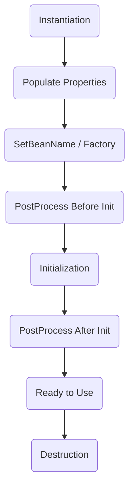

1.  **Instantiation**: The container creates the bean instance (calls constructor).
2.  **Populate Properties**: Dependencies are injected.
3.  **Aware Interfaces**: If bean implements `BeanNameAware`, etc., setters are called.
4.  **Pre-Initialization**: `BeanPostProcessor.postProcessBeforeInitialization()` is called.
5.  **Initialization**: Custom init method (`@PostConstruct` or `init-method` in XML) is executed.
6.  **Post-Initialization**: `BeanPostProcessor.postProcessAfterInitialization()` is called. (AOP proxies are often created here).
7.  **Ready**: Bean is ready for use.
8.  **Destruction**: When container shuts down, `@PreDestroy` or `destroy-method` is called.

##### Implementing Life Cycle Callbacks

**Using Interfaces:**

```java
@Component
public class MyBean implements InitializingBean, DisposableBean {
    @Override
    public void afterPropertiesSet() {
        // Initialization logic
    }

    @Override
    public void destroy() {
        // Cleanup logic
    }
}
```

**Using Annotations (Recommended):**

```java
@Component
public class MyBean {
    @PostConstruct
    public void init() {
        // Initialization logic
    }

    @PreDestroy
    public void cleanup() {
        // Cleanup logic
    }
}
```

\newpage


# Spring Boot {#spring-boot}

\minitoc


Spring Boot is an extension of the Spring Framework that simplifies the setup and development of new Spring applications.

**Key Features:**

- **Auto-Configuration**: Automatically configures Spring based on jar dependencies.
- **Standalone**: Embeds Tomcat, Jetty, or Undertow directly (no need to deploy WAR files).
- **Starter Dependencies**: Simplified build configuration (e.g., `spring-boot-starter-web`).
- **Production-ready**: Metrics, health checks, externalized configuration.

### Difference between Spring and Spring Boot

| Feature           | Spring Framework                           | Spring Boot                                             |
| :---------------- | :----------------------------------------- | :------------------------------------------------------ |
| **Goal**          | Provides infrastructure for building apps. | Simplifies booting and development.                     |
| **Configuration** | Manual (XML or Java-based).                | **Auto-configuration** (Convention over Configuration). |
| **Server**        | External server required (e.g., Tomcat).   | **Embedded server** (Tomcat/Jetty) included.            |
| **Dependency**    | Dependencies managed manually.             | **Starters** simplify dependency management.            |
| **Boilerplate**   | Significant boilerplate code.              | Reduces boilerplate code drastically.                   |

### Build Systems

Spring Boot projects typically use **Maven** or **Gradle**.

- `pom.xml` (Maven)
- `build.gradle` (Gradle)

### Code Structure

```java
com
 +- example
     +- myapp
         +- Application.java (Main Class)
         |
         +- domain (Entities)
         +- repository (DAO)
         +- service (Business Logic)
         +- web (Controllers)
```

### Spring Boot Runners

Interfaces used to run code _after_ the application starts.

1.  **CommandLineRunner**: `run(String... args)`
2.  **ApplicationRunner**: `run(ApplicationArguments args)`

### Logging

Spring Boot uses Commons Logging for all internal logging but leaves the underlying log implementation open. Default is **Logback**.

```java
Logger logger = LoggerFactory.getLogger(MyClass.class);
logger.info("This is an info message");
```

### RESTful Web Services

**REST** (Representational State Transfer) is an architectural style for web services.

#### Annotations

- `@RestController`: Combines `@Controller` and `@ResponseBody`.
- `@RequestMapping`: Maps HTTP requests to handler methods.
- `@RequestBody`: Maps the HTTP request body to a Java object.
- `@PathVariable`: Extracts values from the URI path.
- `@RequestParam`: Extracts query parameters.

#### HTTP Methods

| Method     | Annotation       | Purpose                                    |
| :--------- | :--------------- | :----------------------------------------- |
| **GET**    | `@GetMapping`    | Retrieve a resource.                       |
| **POST**   | `@PostMapping`   | Create a new resource.                     |
| **PUT**    | `@PutMapping`    | Update an existing resource (full update). |
| **DELETE** | `@DeleteMapping` | Delete a resource.                         |

#### Example Controller

```java
@RestController
@RequestMapping("/api/users")
public class UserController {

    // GET /api/users/1
    @GetMapping("/{id}")
    public User getUser(@PathVariable int id) {
        return new User(id, "John");
    }

    // POST /api/users
    @PostMapping
    public User createUser(@RequestBody User user) {
        // save user...
        return user;
    }

    // GET /api/users?role=admin
    @GetMapping
    public List<User> getUsers(@RequestParam(defaultValue = "user") String role) {
        // return users by role...
        return new ArrayList<>();
    }
}
```


\newpage

