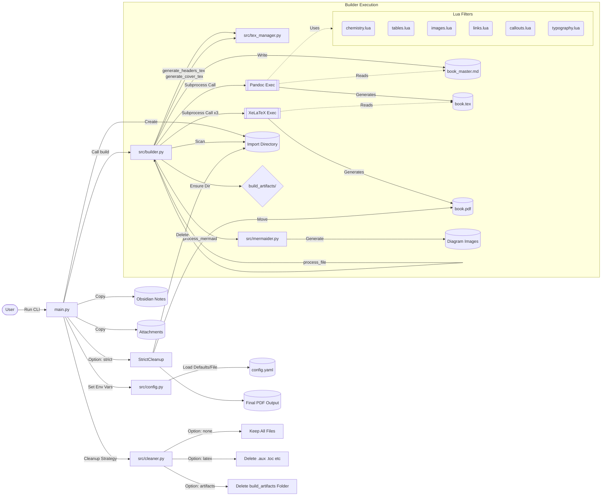

# Build Process Execution Flow

This diagram illustrates the workflow using the `main.py` script, which handles importing, building, and cleanup.

## Workflow Steps

1.  **Import & Setup**: 
    -   `main.py` accepts arguments for vault path, attachments, title, author, etc.
    -   It copies valid notes and attachments to a clean import directory.
    -   It sets environment variables to override default configuration.

2.  **Build Execution**:
    -   The script invokes `src.builder.build()`.
    -   Markdown files are processed (Mermaid generation, header fixing).
    -   Pandoc converts the content to LaTeX using a chain of modular Lua filters (`chemistry`, `tables`, `images`, `callouts`, `links`, `typography`).
    -   XeLaTeX compiles the PDF (3 passes for correct TOC/references).

3.  **Cleanup**:
    -   Based on the `--cleanup` argument:
        -   `latex`: Removes temporary LaTeX files (`.aux`, `.log` is kept).
        -   `artifacts`: Removes the entire `build_artifacts` folder.
        -   `strict`: Moves the final PDF to the user-specified location and deletes the *entire* import directory (source copies + build artifacts).
